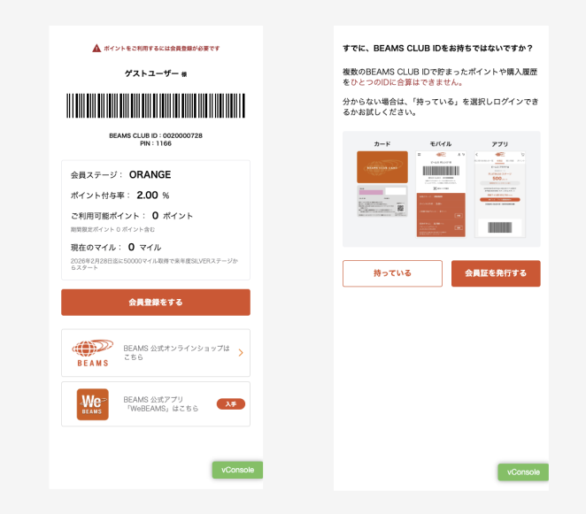
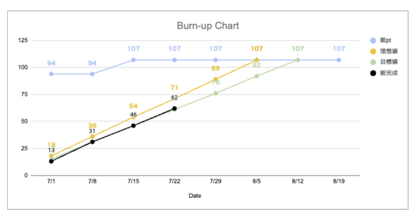

<!-- _class: title -->

# AIを活用した実務プロダクト開発プロセスの共有

四半期報告会  
2025/07/25

リテールアプリ共創部 マッハチーム  
高垣龍平

---

# プロジェクト概要

## 株式会社BEAMS様 LINEミニアプリ会員証開発

- **期間**: わずか3ヶ月で完結（要件定義→開発→受け入れテスト→リリース）
- **開発期間**: 7/1〜8/5のたった1ヶ月
- **体制**:
  - PM: 日吉杏太
  - 開発: 高垣龍平（メイン） + 太田聖治（レビュー・サポート）
  - デザイン: 藤田花梨

### アプリ規模
- 画面数: 10ページほど
- 機能数: 8機能ほど

---

---
# 現在の進捗（開発開始から3週間半）
**ストーリーポイント 62/107（約60%）完成**

---

# AIツールスタック

## 使用AI一覧

- **エディタ**: Cursor
- **AI Agent**: Claude Code（たまにCline）
- **MCP**: Figma MCP
- **その他**: AI Starter

---

# 開発フロー

## 実際のワークフロー

1. **GitHub Issueに細かく要件とタスクを記載**
2. **Claude Codeに雑に依頼** → 約3~4割の完成度で作成
3. **Cursorで細かく修正** → PRまで完成

### デザイン連携
デザイナー（@藤田 花梨さん）作成のFigmaから  
MCPを使ってデータ取得 → コードに落とし込み

---

# AIだけでもう開発現場は回っている？

# → No

## AIだけでは実現できない要素
- 要件・仕様の詰め
- デザイン
- お客さんとの信頼関係構築
- 他社ベンダーとの連携・調整

--- 

# 成功要因の分析

### 1. LINEミニアプリ会員証のアセットの活用
- 整備されたアーキテクチャとリンタールール → AIの開発速度と精度向上に寄与

### 2. 正確に設計された要件定義
- 1ヶ月間お客さんと対面で時間をかけて実施

### 3. 構造化されたデザイン
- デザイナーによる適切な構造でFigmaデザイン作成と、MCP経由でコードに落とし込み

## → 開発に集中できる環境を整えることが重要

---
<!-- _class: h2-text-blue -->

# 重要なポイント

## AIによるコーディングが真価を発揮する条件

- ✅ 整備されたアーキテクチャや統一されたコーディングルール  
- ✅ 正確に設計された要件定義
- ✅ 構造化されたデザイン

これらの土台があってこそ、迅速な開発サイクルが実現可能

その上で、我々クラスメソッドが存在する価値は、AIができない**お客さんとの信頼関係を構築**し、その上でAIを活用した開発をサポートすることです。

---

<!-- _class: section -->

# おわり

