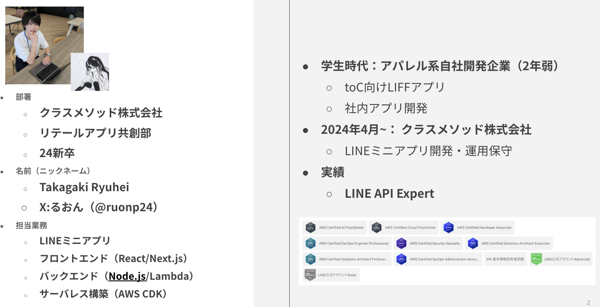
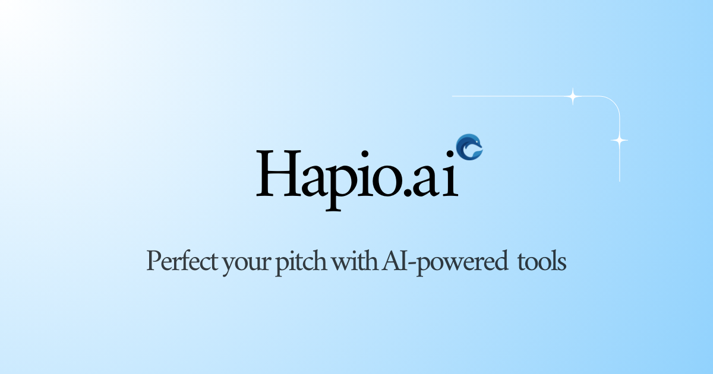
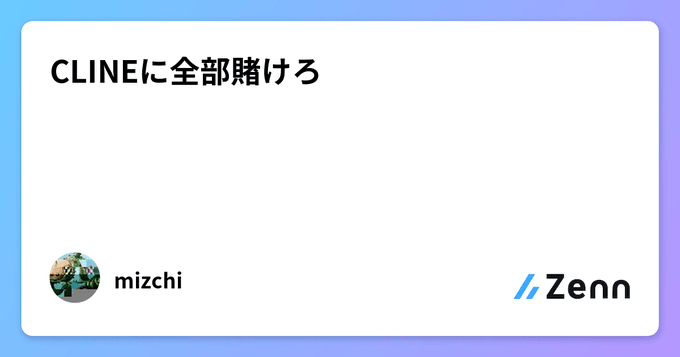
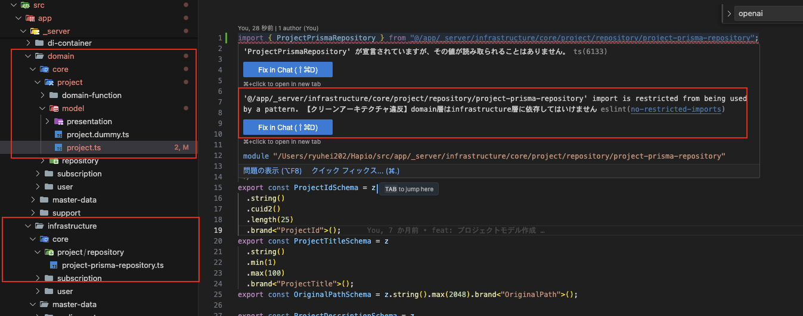
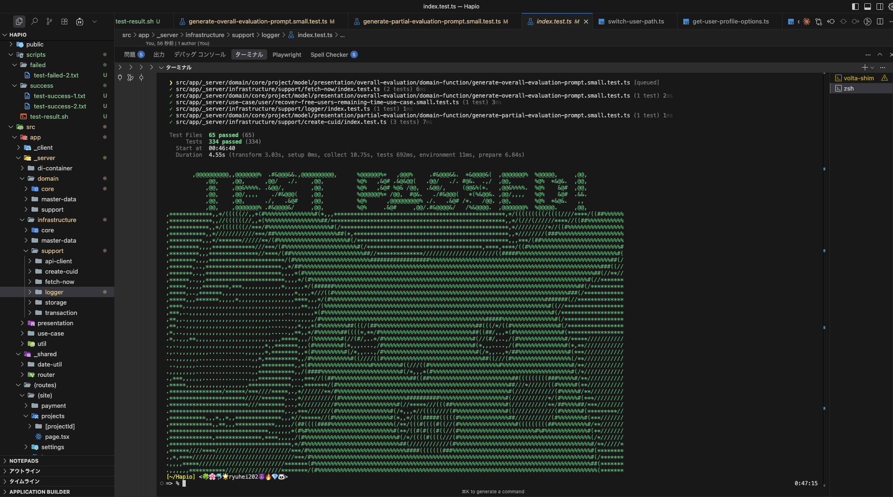

<!-- _class: title -->
<!-- _paginate: false -->


# AIエージェントを使いこなしてプライベートの時間で個人開発アプリをリリースした話

<center>

DevelopersIO 2025

クラスメソッド株式会社 リテールアプリ共創部
高垣龍平
</center>

---

# 自己紹介



---

# 今回お話しする内容

<!-- _class: align-center -->

## 1. AI時代の個人開発について
## 2. 個人開発実践
## 3. AI Agentを用いた開発手法
## 4. まとめ

---

<!-- _class: section -->
<!-- _paginate: false -->

## **AI時代の個人開発について**

---

# みなさん個人開発やってますか？

<br/>

### 個人開発の楽しさ

- 💡 自分のアイデアを形にできる
- 📚 新しい技術を学べる
- 🚀 ポートフォリオとして活用できる
- 🎯 ビジネスチャンスにつながる可能性

### 有名な個人開発事例
- Zenn
- MENTA
- Peing -質問箱-
- etc...

---

# 個人開発、私は大好きです。

<br/>

### 現在開発・運用中のアプリ
**「Hapio AI」**
https://hapio.ai/
- AIを活用したプレゼンテーション練習プラットフォーム
- プレゼンテーションの練習を行うことで、プレゼンテーションスキルを高めることが可能。
- マイクとカメラを使ってリアルタイムにプレゼンテーションの評価を行うことができる。

---


# 従来の個人開発
<br/>

## 課題

- ⏰ **時間がかかる** - 実装に膨大な時間が必要
- 🧑‍💻 **仕事との両立が難しい** - 業務で忙しい中、プライベートの時間で開発は難しい
- 🔧 **技術的ハードルが高い** - フルスタック開発の知識が必要
- 😓 **挫折しやすい** - モチベーション維持が困難
- 💡 **アイデアが浮かばない** - そもそもアイデアが浮かばない..

<br/>

## 結果

多くの人が途中で諦めてしまう...

---


# 現在の個人開発

<br/>

## AI Agentの登場で状況が一変

- ⚡ **開発速度が劇的に向上** - コード生成により従来の数倍〜数十倍のスピード
- 🎓 **技術的ハードルが下がる** - AIがベストプラクティスを提案。わからない分野でも解決できる
- ✅ **要件定義・仕様の壁打ち** - AIと意見を交わしながら要件定義・仕様を詰めることができる
- 🔥 **モチベーション維持しやすい** - 短期間で成果物が見える

<br/>

## **世はまさに、大個人開発時代**

---

# 「ソロプレナー」という生き方への注目

<br/>

## アントレプレナー
- ゼロから会社や事業を創り出す人（起業家）のこと
- 従業員を雇うことでビジネスを運営・拡大する。


<br/>

## **ソロプレナー**
- 自分自身が唯一の従業員であるビジネスを立ち上げる個人事業主
- 従業員を雇わず単独でビジネスを運営する起業家


<br/>

## **AIの力でソロプレナーという生き方・挑戦方法が加速**

---

<!-- _class: section -->
<!-- _paginate: false -->

## **個人開発実践**

---

<!-- _class: content-image -->

# こんなアプリ作りました

# **Hapio AI**


AIがユーザーのプレゼンテーションを多角的に分析・評価し、具体的な改善提案を行うプレゼンテーション練習プラットフォーム

### https://hapio.ai/

<br/>




---

# デモ


https://x.com/ruonp24/status/1943255691487060030


---

# 主な機能

## シチュエーション設定
- **Topic** / **Scene** / **Audience Type** / **Formality Level** / **Language** / **Presentation Purpose**
- **制限時間**も設定可能で、時間管理も実施

## 多角的評価システム（5つの観点から総合評価）
- 内容の正確性・適切 / 言葉遣い・語彙選択の適切性 / シチュエーションとの整合性 / 表情・非言語コミュニケーション / 構成・論理展開の明確性

## 分析内容
- **音声から文字起こし** / **顔の表情を分析** / **設定したシチュエーション、スライド資料、プレゼン内容（文字起こし）を総合的に評価**
- スライド単位での評価 + 全体を通した総合評価

## AI評価とフィードバック
- より良いプレゼン内容をHapio AIが自動で提案
- 過去のプレゼンの評価履歴も閲覧可能

---

# なぜこのアプリを作ったのか

## 個人的に最近プレゼンの機会が多い

- クラスメソッドに入社後、社内および社外でLTや登壇の機会が多い
- 顧客へのプリセールスやMTGなどでプレゼンの機会も多い
- 人前で話すことに苦手意識を持っているため、プレゼンテーションスキルを高めたい（今も課題です...）

## 本番前にプレゼンテーションの練習をしたい

- 時間管理以外に包括的にプレゼンのフィードバックをしてくれるアプリが欲しい
- より本番環境にあったプレゼンテーションを練習したい

## 今後のプレゼンの重要性向上への期待
- AIによる社会の変化の中で、人間的スキルが求められるようになり、プレゼンテーションは必須のスキルとなるのでは
- 需要ありそう

---

# アプリケーションのアーキテクチャ・技術スタック

### フロントエンド・バックエンド
- Next.js

### インフラ
- Vercel
- Supabase
- 一部AWS（画像周りやログなど）

### AI系
- AI SDK
- Amazon Bedrock Claude Haiku 4.5（評価モデル）
- OpenAI GPT-5 mini（評価モデル）
- OpenAI Text-to-Speech API（文字起こし）
- face-api.js（表情分析）

---

# この記事覚えていませんか？

# Clineに全部賭けろ

https://zenn.dev/mizchi/articles/all-in-on-cline （[mizchi](https://x.com/mizchi)さん）

<br/>

<!-- _class: content-image -->



---

<!-- _class: content-image-right content-60 -->

# 個人開発への挑戦動機


## タイミングが最高だった

- 「Clineに全部賭けろ」という記事
- Clineを触ってみた衝撃
- Claude Sonnet 3.7の登場

<br/>


<br/>

## **「今やるしかない・挑戦したい」**
---


<!-- _class: section -->
<!-- _paginate: false -->

## **AI Agentを用いた開発手法**


---
# 開発

## 開発期間
- MVP作成・Beta版リリース：**2月終わり〜7月頭（約4ヶ月）**
- リリース後から細かい修正・改善：**~現在**


## 使用したツール
- エディタ：**Cursor**
- AI Agent: **Cline**（Claude Sonnet、GPTなどいいモデルが出るたびに変更）
- コードレビュー: **CodeRabbit**
- 壁打ち・要件定義: **AI Starter**


## 開発フロー
AI Starterで要件定義や壁打ちを行い、Clineでコードを生成してもらい、Cursorで細かく修正を行う。CodeRabbitでコードレビューとPR作成・フロー図の自動作成。


---
# AI駆動開発のポイント

- ## アーキテクチャの整備
- ## コーディングルールの整備
- ## テストの充実

---
# アーキテクチャの整備
Next.jsフルスタックFW内で`server`と`client`ディレクトリを分け、実行環境を明確化

 <br />

## フロントエンド: Feature-Based
- `/src/app/_client/features/` 配下に機能単位でディレクトリを配置
- `home/`, `project/`, `projects/`, `settings/`

<br />

## バックエンド: Clean Architecture

- domain層 - エンティティ、ビジネスルール
- use-case層 - アプリケーションロジック
- infrastructure層 - 外部システム連携
- presentation層 - API
- **ESLintで依存関係を管理**

---

<!-- _class: small-text -->

# ディレクトリ構成

<br />

```
/src/app
├─ _client/                        # クライアントサイドのコード
│  ├─ common/                      
│  └─ features/                    # 機能単位のディレクトリ
│     ├─ home/                     
│     ├─ project/                  
│     ├─ projects/                 
│     └─ settings/                 
├─ _server/                        # サーバーサイドのコード
│  ├─ domain/                      # ドメイン層（エンティティ、ビジネスルール）
│  ├─ use-case/                    # ユースケース層
│  ├─ infrastructure/              # インフラストラクチャ層
│  ├─ presentation/                # プレゼンテーション層
│  ├─ di-container/                # 依存性注入コンテナ
│  └─ util/                        # ユーティリティ
└─ (routes)/                       # Next.js App Routerのルーティング
   ├─ (site)/                      # 認証済みユーザーのみ閲覧可能
   │  └─  projects/                 # プロジェクト一覧
   └─ (static)/                    # 未認証ユーザーでも閲覧可能
      └─ page.tsx                  # トップページ
```


---
# Eslintで依存関係を管理

<!-- _class: content-image -->

- `eslint.config.mjs`に依存関係を管理するルールを記述
- クリーンアーキテクチャを採用しているため、依存の方向性が間違っている場合などにエラーを出してAIに軌道修正を促す



---

# テストの充実

<!-- _class: content-image -->
- 個人開発とはいえ、テストコードを充実させることで、AIが間違ったコードを書いた場合に自律的に修正してくれる
- テストコードを参照することで、AIに仕様を理解させることも可能



---

<!-- _class: h2-text-blue -->

# 重要なポイント

## 個人開発だからといってアーキテクチャを疎かにしない

- **クリーンアーキテクチャを採用**
- **ESLintで依存関係を管理**
- **serverとclientを分離し、実行環境を明確化**
- **テストの充実**
- **ルールの整備**

<br/>

## なぜアーキテクチャが重要か

- AIエージェントがどこに何の処理を書けば良いかを判断しやすくなる
- AIに渡すコンテキストとして他のファイルを参照させやすい
- コードの品質を保ちながら開発できる
- ESLint＋テストコードにより間違ったコードを書いた場合AIが自律的に修正してくれる

---

# まだまだできないこと

# **AIだけでは完結しない**

<br/>

## 開発まわり

- 要件定義は自分で行う必要がある
- ルールとアーキテクチャの整備も自分で行う必要がある
- デザインは微妙。自分の理想のデザインをコードに落とし込む必要がある
- コードレビューなどをAIエージェントに行わせているとはいえ、最終的な品質チェックは人間が行う

<br/>

## その他
- 開発自体はうまく行ってもマーケティングができないと成果につながらない
- 自分の実現したい機能の要件定義や仕様の設計はAIエージェントに実装させる前に自分で十分に行う必要がある


---

<!-- _class: section -->
<!-- _paginate: false -->

## **まとめ**

---

# まとめ

## AIエージェントで個人開発は加速する

- プライベートの時間でも商用レベルのアプリをリリース可能

## 設計を疎かにしないことが成功の鍵

- 整備されたアーキテクチャがあってこそ、AIが真価を発揮（今回はクリーンアーキテクチャの採用）
- 統一されたコーディングルールが必要（ESLintによるルールや依存関係の管理）
- AIが判断しやすい構造

## AIエージェントが豊富な今こそチャンス

個人開発に挑戦することで、商用レベルのアプリをリリースできる時代です。
ぜひ個人開発に挑戦してみてください！

---

<!-- _class: all-text-center align-center -->


# ご清聴ありがとうございました

**Hapio AI**をぜひお試しください！
