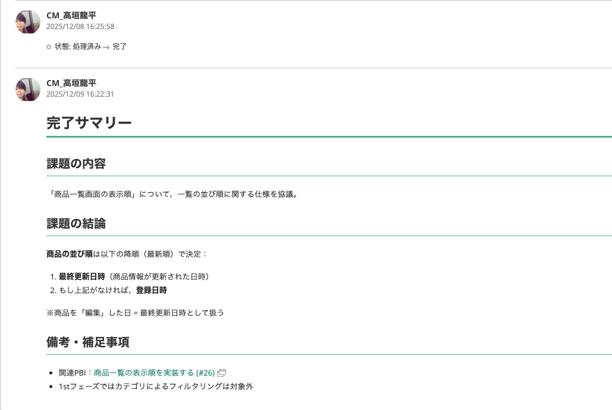
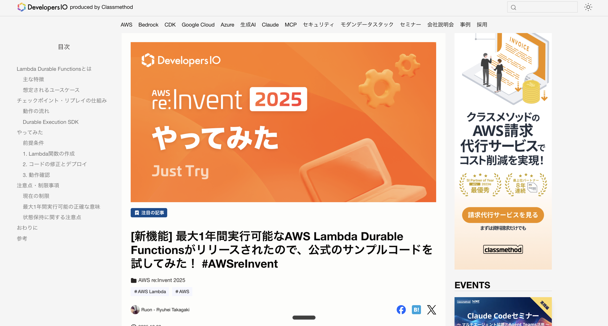

<!-- _class: title -->
<!-- _paginate: false -->


# AWS Lambda durable functionsで**Backlog課題の完了サマリー**を自動生成し、Slackで承認するフローを構築してみた

<center>

2026/03/25
クラスメソッド株式会社 リテールアプリ共創部
高垣 龍平

</center>

---

# 自己紹介


---

# 今日お話しすること

## 1. 背景・モチベーション
## 2. デモ
## 3. なぜ durable functions なのか
## 4. アーキテクチャ全体像
## 5. 処理フローの詳細（ソースコード解説）
## 6. durable functions の重要な概念
## 7. まとめ

---

# みなさんは顧客とのコミュニケーションツールに何を使っていますか？

<br/>

### よく使われるツール
- **Slack** / Microsoft Teams / Chatwork
- **メール**
- **Backlog** / Jira / Redmine などの課題管理ツール

<br/>

### 私たちのチームでは**Backlog**を使っています
→ 課題管理やドキュメント管理等をBacklog上で実施


---

<!-- _class: section -->
<!-- _paginate: false -->

## **背景・モチベーション**

---

# Backlogで課題管理をしていて困ること

<br/>

## 課題の結論や決定事項がどこにあるかわからない

<br/>

### よくある状況
- コメントが大量にあり、最終的な結論が埋もれている
- 後からBacklogを見返したときに「何が決まったのか」わからない
- 新しいメンバーが背景を理解するのに時間がかかる
- AIに過去のやり取りを読み込ませる際にコンテキストを大量に消費してしまう

---

# 解決策：**完了サマリー**を書く運用

<style scoped>
.solution-box {
  background: linear-gradient(135deg, #e3f2fd 0%, #bbdefb 100%);
  border-left: 5px solid #2C67E5;
  border-radius: 0 12px 12px 0;
  padding: 24px 32px;
  margin: 20px 0;
}
</style>

<div class="solution-box">

### 課題が完了したら「完了サマリー」を投稿する
→ 後からBacklogを見たときに**最初に読むべきところ**が一目でわかる

</div>

### 完了サマリーの構成
- **課題の内容** - 何についての課題だったか
- **対応内容・経緯** - どんな議論・対応が行われたか
- **課題の結論** - どう解決・完了されたか
- **備考・補足事項** - 追加で記録すべき情報

---

#  例：

<center>



</center>

---
# でも、手動でやるのは**めんどくさい**

<br/>

### これまでの手動フロー

```
1. Backlog Exporterで課題をローカルにエクスポート
2. Claude Codeのカスタムスラッシュコマンドでサマリー生成
3. 生成されたサマリーをBacklogにコピペ
```

<br/>

### 課題
- 毎回手動で3ステップ踏む必要がある
- エクスポート → 生成 → コピペの繰り返し
- 完了した課題が多いと作業が積み上がる

---

<!-- _class: h2-text-blue -->

# 自動化したい！

<style scoped>
.auto-box {
  background: linear-gradient(135deg, #e8f5e9 0%, #c8e6c9 100%);
  border-left: 5px solid #00897B;
  border-radius: 0 12px 12px 0;
  padding: 24px 32px;
  margin: 20px 0;
  font-size: 1.1em;
}
</style>

<div class="auto-box">

**課題が完了したら自動でAIがサマリーを生成し、Slackで承認フローを経てからBacklogにコメントを投稿する**

</div>

<br/>

### ポイント
- AIが生成したサマリーを**そのまま投稿しない**
- **人間が確認してから**投稿する（承認フロー）
- 完全自動ではなく**Human-in-the-loop**


https://github.com/takagakiryuheiCM/backlog-completion-notifier

---

<!-- _class: section -->
<!-- _paginate: false -->

## **デモ**

---

<!-- _class: small-text -->

# デモ：3ステップで完了

<style scoped>
.demo-grid {
  display: grid;
  grid-template-columns: 1fr 1fr 1fr;
  gap: 16px;
  margin-top: 16px;
}
.demo-card {
  background: #f8f9fa;
  border-radius: 12px;
  padding: 20px;
  border-top: 4px solid #2C67E5;
}
.demo-card.green {
  border-top-color: #00897B;
}
.demo-card.orange {
  border-top-color: #FF9800;
}
.demo-card h3 {
  font-size: 0.95em;
  margin: 0 0 8px 0;
}
.demo-card p {
  font-size: 0.8em;
  margin: 4px 0;
  color: #555;
}
</style>

<div class="demo-grid">

<div class="demo-card">

### Step 1
**Backlogで課題を完了にする**

課題ステータスを「完了」に変更するだけ

</div>

<div class="demo-card green">

### Step 2
**Slackに承認リクエストが届く**

AIが生成したサマリーと「承認して投稿」「却下」ボタンが表示される

</div>

<div class="demo-card orange">

### Step 3
**承認するとBacklogに投稿**

「承認して投稿」をクリックすると、Backlogの課題にコメントが自動投稿される

</div>

</div>

<br/>

### 手動作業はゼロ。Backlogで完了にする → Slackで承認するだけ

---

<!-- _class: section -->
<!-- _paginate: false -->

## **なぜ durable functions なのか**

---

# 通常のLambdaでは実現が難しい

<br/>

## このシステムの肝は**Slackでの人間による承認フロー**

<br/>

### 通常のLambdaの制約
- 最大タイムアウトは**15分**
- 人間の承認を**数時間〜数日**待つことがある
- ポーリングで待機すると**コンピュート料金**が膨大に

<br/>

### Step Functionsという選択肢もあるが...
- Callback パターンは実装可能だが、状態管理が複雑
- JSONベースのASL（Amazon States Language）で記述が必要
- コードの見通しが悪くなりがち

---

# AWS Lambda **durable functions**

<style scoped>
.feature-grid {
  display: grid;
  grid-template-columns: 1fr 1fr;
  gap: 16px;
  margin-top: 16px;
}
.feature-card {
  background: #f8f9fa;
  border-radius: 12px;
  padding: 20px;
  border-left: 4px solid #2C67E5;
}
.feature-card.green {
  border-left-color: #00897B;
}
.feature-card.green h3 {
  color: #00897B;
}
.feature-card.orange {
  border-left-color: #FF9800;
}
.feature-card.orange h3 {
  color: #FF9800;
}
.feature-card.pink {
  border-left-color: #E91E63;
}
.feature-card.pink h3 {
  color: #E91E63;
}
.feature-card h3 {
  color: #2C67E5;
  font-size: 1em;
  margin: 0 0 8px 0;
}
.feature-card p {
  margin: 0;
  font-size: 0.85em;
  color: #555;
}
</style>

## re:Invent 2025で発表された新機能

<div class="feature-grid">

<div class="feature-card">

### 最大1年間実行可能
<p>Lambdaの15分制限を超えた<strong>長時間ワークフロー</strong>を構築</p>

</div>

<div class="feature-card green">

### 待機中コンピュート料金なし
<p>承認待ちの間は<strong>コストゼロ</strong>。必要なときだけ課金</p>

</div>

<div class="feature-card orange">

### チェックポイント/リプレイ
<p>障害時も自動復旧。完了済みステップは<strong>スキップ</strong></p>

</div>

<div class="feature-card pink">

### 通常のコードで記述
<p>Step FunctionsのASLではなく<strong>普通のTypeScript</strong>で書ける</p>

</div>

</div>

---

<center>



</center>

---


# Durable Execution SDK の主要プリミティブ

<style scoped>
table {
  font-size: 0.95em;
  width: 100%;
}
th {
  background: #2C67E5 !important;
  color: white !important;
}
td:first-child {
  font-family: monospace;
  background: #f0f4f8;
  font-weight: 600;
  color: #1a365d;
}
</style>

| プリミティブ | 説明 |
|:--|:--|
| `context.step()` | チェックポイント付きのビジネスロジック実行。リプレイ時はスキップ |
| `context.wait()` | 指定期間の待機。待機中はコンピュート料金なし |
| `context.createCallback()` | 外部システムからの入力を待機（人間の承認フローなど） |
| `context.parallel()` | 複数の操作を並列実行 |
| `context.map()` | 配列の各要素に対して操作を実行 |
| `context.invoke()` | 他のLambda関数を呼び出し |

<br/>

### 今回のユースケースでは `step()` と `createCallback()` が重要

---

<!-- _class: section -->
<!-- _paginate: false -->

## **アーキテクチャ全体像**

---

# システムアーキテクチャ


---

<!-- _class: small-text -->

# 使用技術

<style scoped>
table {
  font-size: 0.95em;
  width: 100%;
}
th {
  background: #2C67E5 !important;
  color: white !important;
}
td:first-child {
  font-weight: 600;
  color: #1a365d;
  background: #f0f4f8;
}
</style>

| 技術 | 用途 |
|:--|:--|
| **AWS Lambda** | API用とdurable functions用の2つ |
| **Amazon Bedrock (Claude Opus 4.5)** | 完了サマリーの生成 |
| **AWS CDK** | インフラのコード管理（v2.232.0〜） |
| **Hono** | API Lambdaのルーティング（モノリシック構成） |
| **inversify** | 依存性注入（DIコンテナ） |
| **Zod** | Webhookリクエストのバリデーション |
| **Backlog API** | 課題情報の取得・コメント投稿 |
| **Slack API** | 承認リクエスト送信・結果通知 |
| **SSM Parameter Store** | 秘匿情報（APIキー、Bot Token）の管理 |


---

<!-- _class: small-text -->

# プロジェクト構成

```
backlog-completion-notifier/
├── infra/                              # CDKインフラコード
│   ├── bin/infra.ts                    # CDKエントリポイント
│   ├── lib/stack/server-stack.ts       # Lambda定義
│   ├── lib/util/ssm.ts                # SSMパラメータ取得
│   ├── config.ts / config-type.ts     # 設定
└── server/                             # サーバーコード
    └── src/
        ├── handler/
        │   ├── api/                    # API Lambda（Hono）
        │   │   ├── handler.ts / app.ts
        │   │   ├── route/webhook/      # Webhookハンドラー
        │   │   ├── schema/             # Zodスキーマ
        │   │   └── middleware/         # Slack payload validator
        │   └── durable/handler.ts      # Durable Function
        ├── use-case/                   # ユースケース層
        ├── domain/                     # ドメイン層（型・テンプレート）
        ├── infrastructure/             # インフラ層（外部API実装）
        └── di-container/               # 依存性注入（inversify）
```

---

# レイヤードアーキテクチャ

<!-- _class: column-layout -->

<style scoped>
.column {
  background: #f8f9fa;
  border-radius: 12px;
  padding: 16px;
  margin: 0 6px;
}
.column h3 {
  color: #2C67E5;
  font-size: 0.9em;
  border-bottom: 2px solid #2C67E5;
  padding-bottom: 6px;
  margin-bottom: 8px;
}
.column ul { font-size: 0.8em; }
</style>

<div class="column">

### Handler層
- Webhookの受信
- リクエストのバリデーション（Zod）
- UseCaseの呼び出し
- レスポンスの返却

</div>

<div class="column">

### UseCase層
- ビジネスロジックの実行
- 各サービスの組み合わせ
- Durableのワークフロー管理

</div>

<div class="column">

### Domain層
- 型定義・インターフェース
- テンプレート（プロンプト/Slack/Backlog）
- ビジネスルール

</div>

<div class="column">

### Infrastructure層
- 外部API実装（Backlog/Slack/Bedrock）
- DurableFunctionClient
- Logger

</div>

---

# 2つのLambda関数

<!-- _class: column-layout -->

<style scoped>
.column {
  background: #f8f9fa;
  border-radius: 12px;
  padding: 20px;
  margin: 0 8px;
}
.column h2 {
  font-size: 0.95em;
  margin-bottom: 12px;
  padding-bottom: 8px;
}
.column.left h2 {
  border-bottom: 3px solid #2C67E5;
  color: #2C67E5;
}
.column.right h2 {
  border-bottom: 3px solid #00897B;
  color: #00897B;
}
.column ul {
  font-size: 0.85em;
}
.column li {
  padding: 4px 0;
}
</style>

<div class="column left">

## API Lambda（backlog-completion-api）

- **Hono**でルーティング
- Backlog WebhookとSlack Webhookを受信
- `/webhook/backlog` → Durable起動
- `/webhook/slack` → コールバック送信
- Function URLで公開

</div>

<div class="column right">

## Durable Lambda（backlog-completion-durable）

- **withDurableExecution**でラップ
- 課題情報取得 → サマリー生成 → 承認待機
- `durableConfig`で待機時間を設定
- 承認後にBacklogへコメント投稿
- Bedrockを呼び出す権限あり

</div>

---

# なぜ**2つのLambda**に分けるのか？

<style scoped>
.reason-box {
  background: linear-gradient(135deg, #fff3e0 0%, #ffe0b2 100%);
  border-left: 5px solid #FF9800;
  border-radius: 0 12px 12px 0;
  padding: 24px 32px;
  margin: 16px 0;
}
.key-point {
  background: linear-gradient(135deg, #e3f2fd 0%, #bbdefb 100%);
  border-left: 5px solid #2C67E5;
  border-radius: 0 12px 12px 0;
  padding: 24px 32px;
  margin: 16px 0;
}
</style>

<div class="reason-box">

### Durable FunctionはFunction URLやAPI Gatewayからの呼び出し自体は可能
> "Durable Lambda functions support **the same invocation methods** as standard Lambda functions"
> — [AWS公式ドキュメント](https://docs.aws.amazon.com/lambda/latest/dg/durable-invoking.html)

</div>

<div class="key-point">

### しかし、コールバックの仕組みが分離を必要とする
待機中のDurable Functionを再開するには、**Lambda API**経由で `SendDurableExecutionCallbackSuccess` を呼ぶ必要がある。これはDurable Function自身への新しいinvocationではなく**AWS APIコール**

</div>

---

# コールバックの仕組みと分離の理由

<style scoped>
.note-box {
  background: #f8f9fa;
  border-radius: 12px;
  padding: 16px 24px;
  margin: 12px 0;
  border-left: 4px solid #DF3756;
}
.note-box h3 {
  color: #DF3756;
  font-size: 0.95em;
  margin: 0 0 8px 0;
}
.note-box p {
  font-size: 0.85em;
  margin: 0;
  color: #555;
}
.flow-box {
  background: linear-gradient(135deg, #e8f5e9 0%, #c8e6c9 100%);
  border-left: 5px solid #00897B;
  border-radius: 0 12px 12px 0;
  padding: 20px 32px;
  margin: 16px 0;
}
</style>

<div class="note-box">

### 各invocationは独立したdurable executionを生成する
<p>Slackのwebhookが同じDurable Functionを叩いても、既存の待機中のexecutionには届かない。<strong>新しいdurable execution</strong>が始まるだけ</p>

</div>

<div class="flow-box">

### そのため、以下の構成が必要
```
Slackボタンクリック
  → API Lambda（通常のLambda）がwebhookを受信
  → SendDurableExecutionCallbackSuccessCommand を実行（AWS API）
  → 待機中のDurable Functionのexecutionが再開
```

</div>

**コールバックを受け取り、Lambda APIを呼ぶ「仲介役」が必要 → それがAPI Lambda**

---

<!-- _class: small-text -->

# CDKのインフラ定義（Durable Function）

```typescript
const durableFunction = new nodejs.NodejsFunction(this, "DurableFunction", {
  functionName: durableFunctionName,
  runtime: lambda.Runtime.NODEJS_22_X,
  entry: path.join(serverSrcPath, "handler/durable/handler.ts"),
  handler: "handler",
  timeout: cdk.Duration.seconds(30),
  memorySize: 1024,
  architecture: lambda.Architecture.ARM_64,
  environment: {
    ...commonEnv,
    BACKLOG_API_KEY, BACKLOG_SPACE_ID: config.backlogSpaceId,
    SLACK_BOT_TOKEN, SLACK_CHANNEL_ID: config.slackChannelId,
  },
  // Durable Functionsの設定
  durableConfig: {
    executionTimeout: cdk.Duration.days(1),  // 最大24時間待機可能
    retentionPeriod: cdk.Duration.days(7),   // 実行履歴を7日間保持
  },
});
```

### ポイント：`durableConfig` を設定するだけでDurable Functionsが有効化される（CDK v2.232.0〜）

---

<!-- _class: small-text -->

# IAM権限の設定

```typescript
// Durable FunctionにBedrock呼び出し権限を付与
durableFunction.addToRolePolicy(
  new iam.PolicyStatement({
    actions: ["bedrock:InvokeModel"],
    resources: ["*"],
  })
);

// API LambdaがDurable Functionを呼び出す権限
durableFunction.grantInvoke(apiFunction);

// API LambdaがDurable Functionのコールバックを送信する権限
apiFunction.addToRolePolicy(
  new iam.PolicyStatement({
    actions: [
      "lambda:SendDurableExecutionCallbackSuccess",
      "lambda:SendDurableExecutionCallbackFailure",
    ],
    resources: [durableFunction.functionArn, `${durableFunction.functionArn}:*`],
  })
);
```

### `SendDurableExecutionCallbackSuccess/Failure` はdurable functions専用のIAMアクション

---

<!-- _class: section -->
<!-- _paginate: false -->

## **処理フローの詳細**

---

# 処理フロー全体像

<style scoped>
.flow-step {
  display: flex;
  gap: 12px;
  margin-top: 16px;
  align-items: stretch;
}
.step {
  flex: 1;
  background: #f8f9fa;
  border-radius: 12px;
  padding: 16px;
  border-top: 4px solid #2C67E5;
  text-align: center;
}
.step.green { border-top-color: #00897B; }
.step.orange { border-top-color: #FF9800; }
.step.pink { border-top-color: #E91E63; }
.step h3 { font-size: 0.85em; margin: 0 0 6px 0; }
.step p { font-size: 0.75em; margin: 2px 0; color: #555; }
.arrow { display: flex; align-items: center; font-size: 1.5em; color: #666; }
</style>

<div class="flow-step">
  <div class="step">
    <h3>Phase 1</h3>
    <p><strong>課題完了検知</strong></p>
    <p>Backlog Webhook</p>
    <p>→ Durable起動</p>
  </div>
  <div class="arrow">→</div>
  <div class="step green">
    <h3>Phase 2</h3>
    <p><strong>サマリー生成</strong></p>
    <p>Bedrock (Claude)</p>
    <p>→ Slack承認リクエスト</p>
  </div>
  <div class="arrow">→</div>
  <div class="step orange">
    <h3>Phase 3</h3>
    <p><strong>ユーザー承認</strong></p>
    <p>Slackボタンクリック</p>
    <p>→ コールバック送信</p>
  </div>
  <div class="arrow">→</div>
  <div class="step pink">
    <h3>Phase 4</h3>
    <p><strong>後処理</strong></p>
    <p>Backlogにコメント</p>
    <p>→ Slackに完了通知</p>
  </div>
</div>

<br/>

### Phase 2 → Phase 3 の間で**最大24時間の待機**が発生（コンピュート料金なし）

---

<!-- _class: small-text -->

# Phase 1：課題完了検知（API Lambda）

## Backlog Webhookを受信し、課題が完了かどうか判定

```typescript
async execute(input: HandleBacklogWebhookInput): Promise<HandleBacklogWebhookOutput> {
  // 課題更新イベント以外は無視
  if (input.type !== BacklogEventType.ISSUE_UPDATED) {
    return { status: "ignored", reason: "Not an issue update event" };
  }

  // 課題が完了状態でなければ無視
  if (!isIssueCompleted(input)) {
    return { status: "ignored", reason: "Issue is not completed" };
  }

  const issueKey = getIssueKey(input);

  // Durable Functionを非同期起動
  await this.#durableFunctionClient.invoke({
    issueKey,
    projectKey: input.project.projectKey,
    issueSummary: input.issue.summary,
    issueDescription: input.issue.description || "",
  });

  return { status: "invoked", issueKey };
}
```

---

<!-- _class: small-text -->

# Durable Functionの起動方法

## `InvocationType: "Event"` で非同期呼び出し

```typescript
export class LambdaDurableFunctionClient implements DurableFunctionClient {
  async invoke(params: DurableFunctionParams): Promise<void> {
    // Durable Functionはqualified ARN（バージョン指定）が必要
    const command = new InvokeCommand({
      FunctionName: this.#functionName,
      Qualifier: "$LATEST",
      InvocationType: "Event",  // 非同期呼び出し
      Payload: JSON.stringify(params),
    });
    await this.#lambdaClient.send(command);
  }
}
```

<br/>

### ポイント
- **`Qualifier: "$LATEST"`** が必要（Durable Functionsの要件）
- **`InvocationType: "Event"`** で非同期呼び出し（API Lambdaは即座にレスポンスを返す）

---

<!-- _class: small-text -->

# Durable Function Handler

## `withDurableExecution` でハンドラーをラップ

```typescript
import { withDurableExecution, DurableContext } from "@aws/durable-execution-sdk-js";

interface DurableFunctionInput {
  issueKey: string;
  projectKey: string;
  issueSummary: string;
  issueDescription: string;
}

const container = registerContainer();

export const handler = withDurableExecution(
  async (event: DurableFunctionInput, context: DurableContext) => {
    const useCase = container.get<ProcessIssueCompletionUseCase>(
      serviceId.PROCESS_ISSUE_COMPLETION_USE_CASE
    );
    return useCase.execute({ issueKey: event.issueKey }, context);
  }
);
```

### `withDurableExecution` でラップすることで `DurableContext` が利用可能に

---

<!-- _class: small-text -->

# Phase 2：サマリー生成・承認リクエスト（Durable Lambda）

## `context.step()` でチェックポイントを設定しながら処理を進める

```typescript
// Step 1: 課題詳細とコメントを取得
const issueDetails = await context.step("fetch-issue-details", async () => {
  const [issue, comments] = await Promise.all([
    this.#backlogRepository.getIssue(issueKey),
    this.#backlogRepository.getComments(issueKey),
  ]);
  return { issueKey, issueSummary: issue.summary, /* ... */ };
});

// Step 2: 完了サマリーを生成（Bedrock Claude Opus 4.5）
const summary = await context.step("generate-summary", async () => {
  const prompt = buildCompletionSummaryPrompt({
    issueKey: issueDetails.issueKey,
    issueSummary: issueDetails.issueSummary,
    issueDescription: issueDetails.issueDescription,
    comments: issueDetails.comments,
  });
  return this.#summaryGenerator.generate(prompt);
});
```

---

<!-- _class: small-text -->

# Phase 2（続き）：コールバック作成とSlack通知

```typescript
// Step 3: コールバックを作成（最大24時間待機）
const [callbackPromise, callbackId] = await context.createCallback("approval", {
  timeout: { hours: 24 },
});

// Step 4: Slack承認リクエストを送信
await context.step("send-approval-request", async () => {
  const message = buildApprovalMessage({
    channel: this.#slackChannelId,
    issueKey: issueDetails.issueKey,
    issueSummary: issueDetails.issueSummary,
    issueUrl: issueDetails.issueUrl,
    callbackId,  // ← ボタンにcallbackIdを埋め込む
  });
  await this.#slackNotifier.postMessage(message);
});

// Step 4.5: サマリーをスレッドに投稿
await context.step("send-summary-thread", async () => {
  await this.#slackNotifier.postMessage({
    channel: this.#slackChannelId,
    text: `*完了サマリー:*\n${summary}`,
    thread_ts: approvalMessageResult.ts,
  });
});

// ここで待機！（コンピュート料金なし）
const result = await callbackPromise;
```

---

# callbackIdの受け渡しが**肝**

<style scoped>
.key-box {
  background: linear-gradient(135deg, #fff3e0 0%, #ffe0b2 100%);
  border-left: 5px solid #FF9800;
  border-radius: 0 12px 12px 0;
  padding: 12px 20px;
  margin: 8px 0;
}
</style>

<div class="key-box">

 `createCallback()` で生成した `callbackId` を Slackボタンの `value` に埋め込む
→ ユーザーがボタンをクリックしたとき、`callbackId` で待機中のDurable Functionを特定できる

</div>

```typescript
// Slackの承認ボタンにcallbackIdを埋め込む
elements: [
  {
    type: "button",
    text: { type: "plain_text", text: "承認して投稿" },
    style: "primary",
    action_id: "approve",
    value: JSON.stringify({ callbackId, approved: true }),
  },
  {
    type: "button",
    text: { type: "plain_text", text: "却下" },
    style: "danger",
    action_id: "reject",
    value: JSON.stringify({ callbackId, approved: false }),
  },
],
```

---

<!-- _class: small-text -->

# Phase 3：ユーザー承認（API Lambda）

## Slackボタンクリック → コールバック送信

```typescript
async execute(input: HandleSlackWebhookInput): Promise<HandleSlackWebhookOutput> {
  const { callbackId, approved, userName } = input;

  if (approved) {
    // 承認: SendDurableExecutionCallbackSuccessCommand
    await this.#durableFunctionClient.sendCallbackSuccess(callbackId, {
      approved: true,
      approvedBy: userName,
      approvedAt: this.#fetchNow().toISOString(),
    });
  } else {
    // 却下: SendDurableExecutionCallbackFailureCommand
    await this.#durableFunctionClient.sendCallbackFailure(callbackId, {
      rejectedBy: userName,
    });
  }

  return buildApprovalResponse({ approved, userName });
}
```

---

<!-- _class: small-text -->

# コールバック送信の実装

## AWS SDK v3の新コマンドを使用

```typescript
async sendCallbackSuccess(callbackId: string, result: ApprovalResult): Promise<void> {
  const command = new SendDurableExecutionCallbackSuccessCommand({
    CallbackId: callbackId,
    Result: new TextEncoder().encode(JSON.stringify(result)),
  });
  await this.#lambdaClient.send(command);
}

async sendCallbackFailure(callbackId: string, rejection: RejectionInfo): Promise<void> {
  const command = new SendDurableExecutionCallbackFailureCommand({
    CallbackId: callbackId,
    Error: {
      ErrorType: "REJECTED",
      ErrorMessage: `Rejected by ${rejection.rejectedBy}`,
    },
  });
  await this.#lambdaClient.send(command);
}
```

### `SendDurableExecutionCallbackSuccessCommand` / `FailureCommand` は最新のAWS SDK v3で追加

---

<!-- _class: small-text -->

# Phase 4：後処理（リプレイ）

## コールバック解決後、Durable Functionがリプレイされる

```typescript
// callbackPromiseが解決された後の処理
try {
  const result = await callbackPromise;
  approval = JSON.parse(result) as CallbackResult;
} catch {
  // 却下またはタイムアウト → Slackに却下通知
  await context.step("send-rejection-notification", async () => {
    await this.#slackNotifier.postMessage(/* 却下通知 */);
  });
  return { issueKey, status: "rejected", summary };
}

// 承認時の処理
if (approval.approved) {
  // Step 5: Backlogにコメント投稿
  await context.step("post-backlog-comment", async () => {
    const comment = buildBacklogComment({ summary });
    await this.#backlogRepository.addComment(issueKey, comment);
  });

  // Step 6: Slackに完了通知
  await context.step("send-completion-notification", async () => {
    await this.#slackNotifier.postMessage(/* 完了通知 */);
  });
}
```

---

<!-- _class: section -->
<!-- _paginate: false -->

## **durable functions の重要な概念**

---

# チェックポイント / リプレイ機構

<style scoped>
.replay-box {
  background: linear-gradient(135deg, #e3f2fd 0%, #bbdefb 100%);
  border-left: 5px solid #2C67E5;
  border-radius: 0 12px 12px 0;
  padding: 24px 32px;
  margin: 20px 0;
}
</style>

<div class="replay-box">

### リプレイの流れ
1. 関数が実行され、各 `step()` 完了時に**チェックポイントが保存**される
2. 障害発生 or `wait()` / `callback` 完了時に**関数を最初から再実行**
3. 完了済み `step()` は**スキップ**され、保存された結果を使用
4. 未完了の処理から**再開**

</div>

### メリット
- **障害耐性** - 処理中にエラーが発生しても、チェックポイントから再開
- **長時間実行** - 待機中はコンピュート料金が発生しない
- **冪等性** - リプレイ時に同じ処理が重複実行されない

---

# 注意点：リプレイで気をつけること

<style scoped>
.note-grid {
  display: grid;
  grid-template-columns: 1fr 1fr;
  gap: 12px;
  margin-top: 12px;
}
.note-card {
  background: #f8f9fa;
  border-radius: 12px;
  padding: 16px;
  border-left: 4px solid #DF3756;
}
.note-card h3 {
  color: #DF3756;
  font-size: 0.9em;
  margin: 0 0 8px 0;
}
.note-card p {
  margin: 0;
  font-size: 0.8em;
  color: #555;
}
</style>

<div class="note-grid">

<div class="note-card">

### 決定論的なコードが必要
<p><code>context.step()</code>外でランダムな値やDate.now()を使うと、リプレイ時に結果が変わってしまう</p>

</div>

<div class="note-card">

### stepの返り値で状態を引き継ぐ
<p>グローバル変数や return していない値はリプレイ時にリセットされる。次のステップに引き継ぎたい値は必ず <strong>return</strong></p>

</div>

<div class="note-card">

### 15分のタイムアウトは変わらない
<p>「最大1年間実行可能」は<strong>待機を挟んだワークフロー全体</strong>の話。各stepの実行自体は15分以内</p>

</div>

<div class="note-card">

### Callback の try-catch
<p><code>sendCallbackFailure</code> が送信された場合や<strong>タイムアウト</strong>の場合は Promise が reject される。try-catchで却下処理を行う</p>

</div>

</div>

---

<!-- _class: section -->
<!-- _paginate: false -->

## **まとめ**

---

# まとめ

<style scoped>
.summary-item {
  background: #f8f9fa;
  border-radius: 8px;
  padding: 12px 20px;
  margin: 8px 0;
  border-left: 4px solid #2C67E5;
}
.summary-item h3 {
  color: #2C67E5;
  font-size: 0.95em;
  margin: 0 0 4px 0;
}
.summary-item.green { border-left-color: #00897B; }
.summary-item.green h3 { color: #00897B; }
.summary-item.orange { border-left-color: #FF9800; }
.summary-item.orange h3 { color: #FF9800; }
.summary-item.pink { border-left-color: #E91E63; }
.summary-item.pink h3 { color: #E91E63; }
.summary-item p {
  margin: 0;
  font-size: 0.85em;
  color: #555;
}
</style>

<div class="summary-item">

### durable functionsで人間の承認フローを実現
<p>Lambda内で最大1年間待機可能。待機中はコンピュート料金なし</p>

</div>

<div class="summary-item green">

### callbackIdの受け渡しがシステム連携の鍵
<p>createCallback() → Slackボタンに埋め込み → SendDurableExecutionCallbackSuccess で待機解除</p>

</div>

<div class="summary-item orange">

### チェックポイント/リプレイで障害耐性を確保
<p>step()で保存したチェックポイントにより、リプレイ時に完了済み処理をスキップ</p>

</div>

<div class="summary-item pink">

### 普通のTypeScriptコードで書ける
<p>Step FunctionsのASLではなく、馴染みのある言語でワークフローを記述可能</p>

</div>

---

# 参考リンク

<br/>

- **ブログ記事**
  - https://dev.classmethod.jp/articles/aws-lambda-durable-functions-backlog-slack/

- **GitHub リポジトリ**
  - https://github.com/takagakiryuheiCM/backlog-completion-notifier

- **AWS 公式ドキュメント**
  - https://docs.aws.amazon.com/lambda/latest/dg/durable-functions.html
  - https://docs.aws.amazon.com/lambda/latest/dg/durable-execution-sdk.html

- **Durable Execution SDK**
  - https://github.com/aws/aws-durable-execution-sdk-js

---

<!-- _class: all-text-center align-center -->


# ご清聴ありがとうございました
