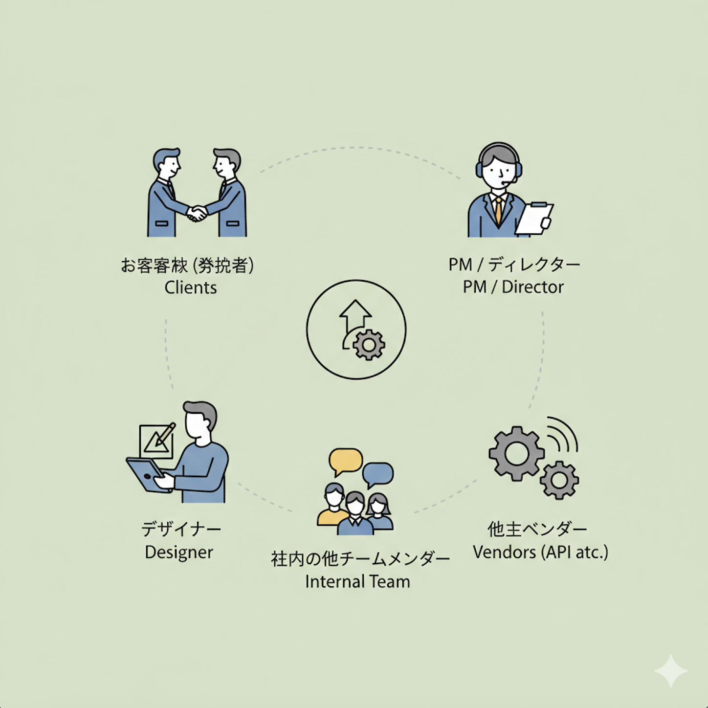
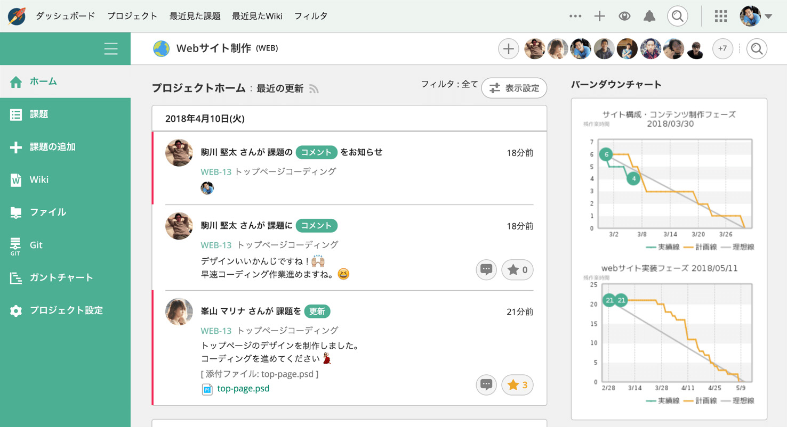
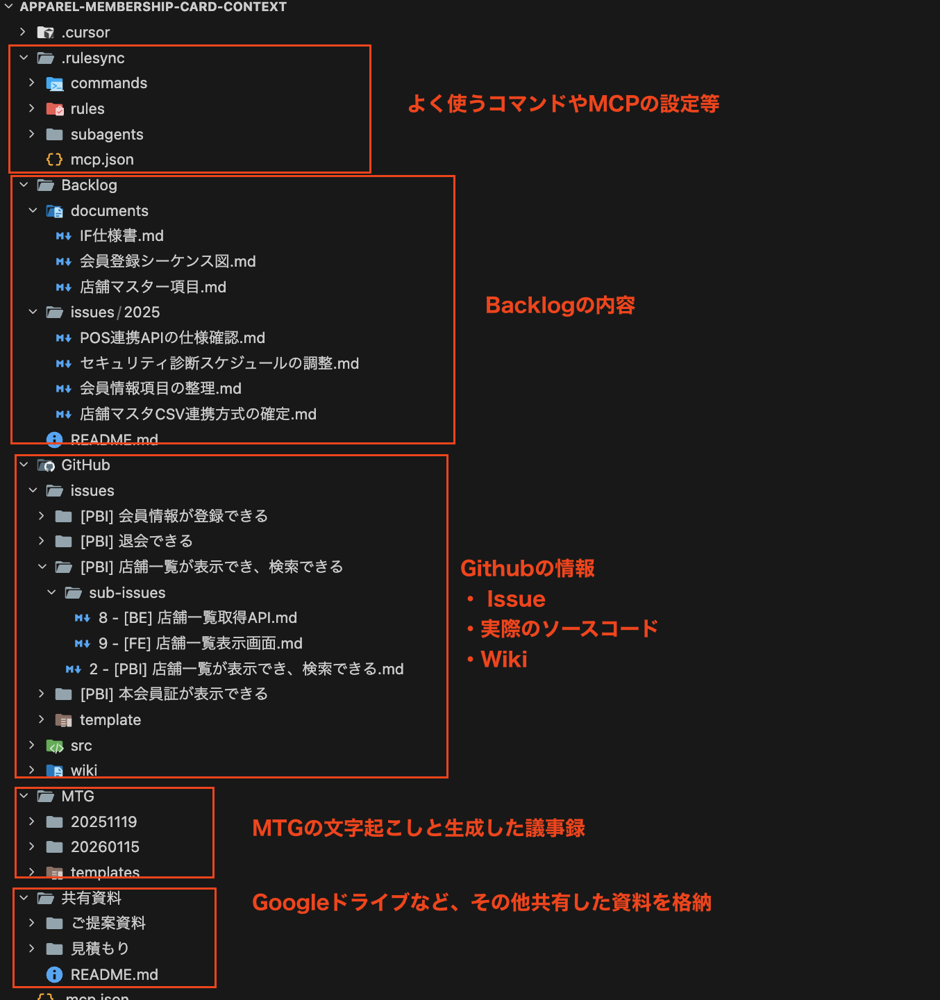
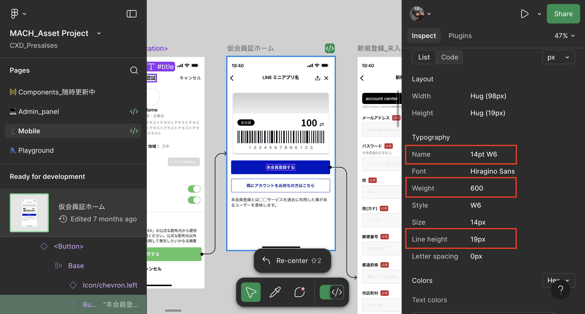
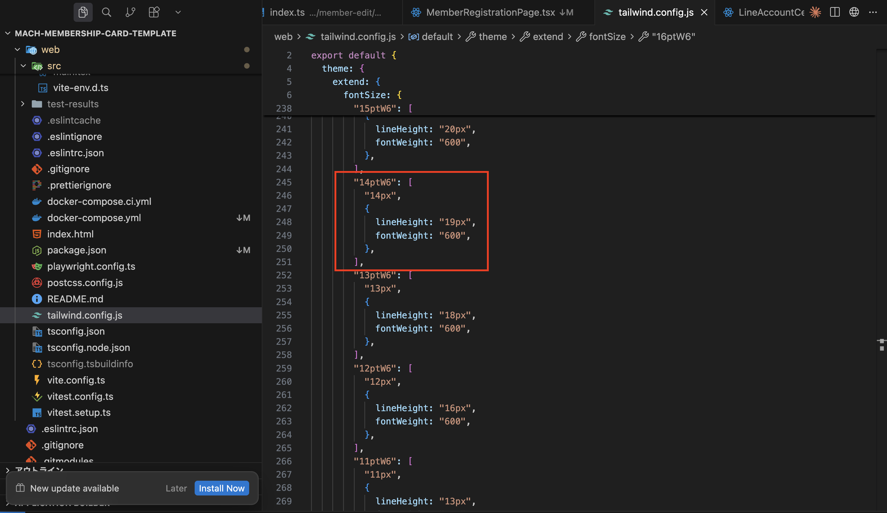

<!-- _class: title -->
<!-- _paginate: false -->


# 全てのコンテキストを集約し**真の仕様駆動**を実現。プロジェクト全体の開発を高速化する方法

<center>

2025/07/28
AI時代の開発高速化スペシャル by クラスメソッド
クラスメソッド株式会社 リテールアプリ共創部 マッハチーム
高垣 龍平

</center>

---

# 自己紹介


---

# 今日お話しする内容

## 1. AIと仕様駆動の現状
## 2. コンテキストをローカルに集約する
## 3. 開発スタイルとドキュメント整備
## 4. さらなる高速化の秘訣
## 5. まとめ

---

<!-- _class: section -->
<!-- _paginate: false -->

## **AIと仕様駆動の現状**

---

# 仕様駆動開発とは

## AIにコードを書かせる前に「仕様」を先に作る開発手法

<br/>

### 代表的なツール・手法
- **Kiro** - AWSが開発したspec駆動のAI IDE
- **GitHub Spec Kit** - Github社が開発したspecファイルを使った仕様駆動開発ツール

<br/>

### 共通するコンセプト
requirements/design/tasksなどのファイルを生成し、Specファイルとして扱う。
これらに要求や仕様・タスクを記述し、AIに読み込ませる

---

# でも、実際のプロジェクトでうまくいっていますか？

<style scoped>
img {
  position: absolute;
  right: 120px;
  bottom: 100px;
  width: 380px;
}
</style>

## 実際のプロジェクトは**エンジニア1人とAIだけ**で完結しない

<br/>

### 多くのステークホルダーが存在する
- お客様（発注者）
- PM / ディレクター
- デザイナー
- 他社ベンダー（API連携先など）
- 社内の他チームメンバー



---

<!-- _class: column-layout -->

# 本当に必要な**コンテキスト**とは？

<style scoped>
.column {
  background: linear-gradient(135deg, #f8f9fa 0%, #e9ecef 100%);
  border-radius: 12px;
  padding: 20px;
  margin: 0 8px;
  box-shadow: 0 2px 8px rgba(0,0,0,0.08);
}
.column h2 {
  font-size: 0.95em;
  margin-bottom: 12px;
  padding-bottom: 8px;
}
.column.left h2 {
  border-bottom: 3px solid #888;
}
.column.right h2 {
  border-bottom: 3px solid #2C67E5;
}
.column ul {
  font-size: 0.85em;
}
.column li {
  padding: 4px 0;
}
</style>

<div class="column left">

## 従来のSpec駆動が扱う範囲

- 設計書・シーケンス図
- API仕様書
- DB設計
- Figmaデザイン
- 既存コードベース
- 要件定義書

</div>

<div class="column right">

## これらも全てコンテキスト

- Backlogの課題・決定事項
- MTGでの合意内容
- 先方のスケジュール
- 使用できる予算
- 自社のリソース状況
- 過去の議事録・見積もり

</div>

---

<!-- _class: h2-text-blue -->

# 仕様駆動ツールが**うまくいかない理由**

<br/>

## `spec/` だけに仕様を書いても、プロジェクト全体のコンテキストがAIに伝わらない

<br/>

### 結果として...
- AIが背景を理解せず的外れな提案をする
- 「なぜこの仕様なのか」がコードに反映されない
- 手戻りが発生し、結局時間がかかる

---

# 「真の仕様駆動」とは何か

<style scoped>
.comparison {
  display: flex;
  gap: 16px;
  margin-top: 20px;
}
.stage {
  flex: 1;
  padding: 20px;
  border-radius: 12px;
  position: relative;
}
.stage.vibe {
  background: linear-gradient(135deg, #ffebee 0%, #ffcdd2 100%);
  border-left: 4px solid #e57373;
}
.stage.spec {
  background: linear-gradient(135deg, #fff8e1 0%, #ffecb3 100%);
  border-left: 4px solid #FFB300;
}
.stage.true {
  background: linear-gradient(135deg, #e8f5e9 0%, #c8e6c9 100%);
  border-left: 4px solid #00897B;
}
.stage h3 {
  font-size: 0.9em;
  margin-bottom: 8px;
}
.stage p {
  font-size: 0.8em;
  margin: 4px 0;
}
.arrow {
  display: flex;
  align-items: center;
  font-size: 1.5em;
  color: #666;
}
</style>

<div class="comparison">
  <div class="stage vibe">
    <h3>🎲 Vibeコーディング</h3>
    <p>思いつきで実装</p>
    <p>動けばOK</p>
    <p>仕様は後付け</p>
  </div>
  <div class="arrow">→</div>
  <div class="stage spec">
    <h3>📝 仕様駆動（従来）</h3>
    <p>計画を構造化</p>
    <p>spec/design/planを作成</p>
    <p>しかし<strong>機能仕様のみ</strong></p>
  </div>
  <div class="arrow">→</div>
  <div class="stage true">
    <h3>🎯 真の仕様駆動</h3>
    <p><strong>全てのコンテキスト</strong>を参照</p>
    <p>決定経緯・制約・背景も把握</p>
    <p>実案件に耐えうる品質</p>
  </div>
</div>

---

# 真の仕様駆動の定義

<style scoped>
.definition-box {
  background: linear-gradient(135deg, #e3f2fd 0%, #bbdefb 100%);
  border-left: 5px solid #2C67E5;
  padding: 24px 32px;
  border-radius: 0 12px 12px 0;
  margin: 20px 0;
  font-size: 1.1em;
}
.key-point {
  display: flex;
  align-items: flex-start;
  margin: 16px 0;
  padding: 12px;
  background: #f8f9fa;
  border-radius: 8px;
}
.key-point .icon {
  font-size: 1.5em;
  margin-right: 12px;
}
.key-point .text {
  font-size: 0.9em;
}
</style>

<div class="definition-box">

**全ての会話・やり取り・決定履歴を参照可能にし、**
**本番環境で顧客の要望を満たす実装を実現すること**

</div>

<div class="key-point">
  <span class="icon">💡</span>
  <span class="text">Kiro等の仕様駆動ツールは「計画の構造化」に過ぎず、<br>実案件の複雑さには対応できない</span>
</div>

<div class="key-point">
  <span class="icon">🔑</span>
  <span class="text">コンテキストエンジニアリングのエッセンスを加えることで、<br>初めて「実案件に耐えうる仕様駆動」が実現できる</span>
</div>

---

<!-- _class: section -->
<!-- _paginate: false -->

## **コンテキストをローカルに集約する**

---

# 情報の分散問題

<!-- _class: column-layout -->

<div class="column">

## 情報はいろいろな場所に散らばっている

- **Backlog** - 課題・Wiki
- **GitHub** - Issue・PR・コード
- **Teams/Slack** - MTG・チャット
- **Google Drive** - 共有資料
- **Figma** - デザイン
- **Notion** - ドキュメント

</div>

<div class="column">

## AIエージェントの現状

- 各ツールへのAPI接続が必要
- MCPの設定が複雑
- レスポンスが遅い
- コンテキスト制限に引っかかる
- リアルタイム取得のオーバーヘッド

</div>

---

<!-- _class: h2-text-blue -->

# 解決策：**全てをローカルに落とす**

<style scoped>
.solution-box {
  background: linear-gradient(135deg, #e3f2fd 0%, #bbdefb 100%);
  border-left: 5px solid #2C67E5;
  border-radius: 0 12px 12px 0;
  padding: 24px 32px;
  margin: 20px 0;
  font-size: 1.1em;
}
.solution-box code {
  background: rgba(44, 103, 229, 0.15);
  padding: 2px 8px;
  border-radius: 4px;
}
.rag-label {
  display: inline-block;
  background: #2C67E5;
  color: white;
  padding: 8px 16px;
  border-radius: 20px;
  font-weight: bold;
  margin-top: 16px;
}
</style>

<div class="solution-box">

プロジェクト全体のリソースを<code>ローカルファイル</code>として集約
→ AIエージェントが直接ファイルを読み込む
→ 高速かつ確実にコンテキストを取得

</div>

<span class="rag-label">オレオレ簡易RAG</span>

ローカル環境でAIおよび人間が**全文検索**できる
情報の一元化が実現

---


<!-- _class: content-image-right content-50 -->

# 例：Backlogの課題をローカルに落とす

<style scoped>
.tool-box {
  background: linear-gradient(135deg, #e8f5e9 0%, #c8e6c9 100%);
  border-radius: 12px;
  padding: 16px;
  margin: 12px 0;
  border-left: 4px solid #00897B;
}
.tool-box h3 {
  color: #00897B;
  margin: 0 0 8px 0;
  font-size: 0.95em;
}
</style>

## Backlogとは
- プロジェクト管理ツール
- **お客様とのやり取り**に使用されることが多い

<div class="tool-box">

### 📦 backlog-exporter
課題・Wiki・ドキュメントをMarkdown形式でエクスポート

```bash
pnpm dlx backlog-exporter@latest update
```

https://github.com/ShuntaToda/backlog-exporter

</div>



---

<!-- _class: small-text -->

# ディレクトリ構造の例

```
apparel-membership-card-context/
├── MTG/                  # 議事録（Teamsの自動文字起こしを配置）
│   └── 20251105/
│       ├── 20251105_minutes.md      # 議事録
│       └── 20251105_キックオフ.docx  # 文字起こし元
├── 共有資料/              # 要件整理・見積もりなど（Google Driveからインポート）
├── Backlog/              # Backlogからエクスポートされたデータ
│   ├── documents/        # 仕様書・シーケンス図など
│   │   ├── マスターデータ定義.md
│   │   ├── 機能要件.md
│   │   └── IF仕様書.md
│   └── issues/           # Backlog課題
├── GitHub/               # GitHubからエクスポートされたデータ
│   ├── issues/           # Issue定義ファイル
│   ├── src/              # ソースコード 🔗 サブモジュール
└── └── wiki/             # GitHub Wiki 🔗 サブモジュール
```

> 💡 `src/` と `wiki/` は**別リポジトリをサブモジュール**で参照
> → コンテキストリポジトリと開発リポジトリを分離しつつ、ローカルで一元管理

---

# ディレクトリ構造の例（サンプルを用意しました）
<center>



</center>

---

# できること：開発だけじゃない

<!-- _class: column-layout -->

<style scoped>
.column {
  background: #f8f9fa;
  border-radius: 12px;
  padding: 16px;
  margin: 0 6px;
}
.column h2 {
  font-size: 0.9em;
  color: #2C67E5;
  border-bottom: 2px solid #2C67E5;
  padding-bottom: 6px;
  margin-bottom: 10px;
}
.column ul {
  font-size: 0.85em;
}
.highlight-box {
  background: #e3f2fd;
  border-radius: 8px;
  padding: 12px;
  margin-top: 12px;
  font-size: 0.8em;
}
</style>

<div class="column">

## 開発

- Issue駆動の実装
- コードレビュー
- テスト作成
- リファクタリング

</div>

<div class="column">

## 開発以外

- **要件定義の整理**
- **見積もり作成**
- **資料作成**
- **議事録生成**
- **進捗レポート作成**
- **IF仕様書の作成**
- **シーケンス図（Mermaid）**
- **Backlogコメント返信**

</div>

---


# ローカル集約の**メリット**

<style scoped>
.merit-grid {
  display: grid;
  grid-template-columns: 1fr 1fr;
  gap: 16px;
  margin-top: 16px;
}
.merit-card {
  background: #f8f9fa;
  border-radius: 12px;
  padding: 20px;
  border-left: 4px solid #2C67E5;
}
.merit-card h3 {
  color: #2C67E5;
  font-size: 1em;
  margin: 0 0 8px 0;
}
.merit-card.green {
  border-left-color: #00897B;
}
.merit-card.green h3 {
  color: #00897B;
}
.merit-card.orange {
  border-left-color: #FF9800;
}
.merit-card.orange h3 {
  color: #FF9800;
}
.merit-card.pink {
  border-left-color: #E91E63;
}
.merit-card.pink h3 {
  color: #E91E63;
}
.merit-card ul {
  margin: 0;
  font-size: 0.85em;
}
.merit-card li {
  padding: 2px 0;
}
</style>

<div class="merit-grid">

<div class="merit-card green">

### 1. 全文検索が可能
- AIも人間も同じファイルを検索
- grepやripgrepで高速検索

</div>

<div class="merit-card">

### 2. ローカル環境で編集可能
- AIエージェントが直接ファイル編集
- 人間による細かい修正も柔軟に対応可能
- バージョン管理も容易

</div>

<div class="merit-card orange">

### 3. API/MCPが不要
- コンテキスト取得が高速
- レート制限を気にしない
- オフラインでも作業可能

</div>

<div class="merit-card pink">

### 4. プレビューが容易
- Markdownはプレビュー表示
- CSVは拡張機能でExcel風に確認

</div>

</div>

---

# ローカル集約の**デメリット**と対策

<br/>

## デメリット
リアルタイムにリモートの状態が更新されない
→ **手動で同期する必要がある**

<br/>

### 対策①：package.jsonにコマンドを用意

```json
{
  "scripts": {
    "issue:update": "./sync-github-issues.sh --repo owner/repo",
    "backlog:update": "pnpm dlx backlog-exporter@latest update --force",
    "rulesync:generate": "pnpm dlx rulesync@latest generate"
  }
}
```

### 対策②：GitHub Actionsで1時間ごとに自動更新も可能
→ 最新のコンテキストを維持

---

# 各ツールの同期方法

| ツール | 同期方法 | 備考 |
|--------|----------|------|
| **GitHub** | `gh` コマンド | Issue/PR/Wikiの取得・更新 |
| **Backlog** | `backlog-exporter` | 課題・Wikiのエクスポート（取得） |
| **Google Drive** | 手動コピー | 重要資料のみ |
| **Teams** | 文字起こしをコピー | MTG後に手動配置・AI議事録生成 |
| **Figma** | **MCP経由** | ローカル同期困難 |

<br/>

### Figmaは例外
ローカルに落とすのが難しいため、**開発時にMCP経由でリモート状態を読む**

---

# 将来の予想

<br/>

## 将来的には全てリモート状態になるだろう

- MCPの成熟
- AIエージェントの性能向上
- リアルタイム同期の標準化

<br/>

## しかし、現状のLLM/AIエージェント性能では...

**ローカル集約が最も現実的で効率的**

<br/>

一部手動更新があるが、**ある程度割り切り**

---

<!-- _class: section -->
<!-- _paginate: false -->

## **開発スタイルとドキュメント整備**

---

# rulesyncの活用

<br/>

## rulesyncとは
複数のルールファイルから統合されたルールファイルを生成するツール

<br/>

## メリット
- `.cursor/rules/` `.claude/` など複数のAIツールに対応
- カスタムコマンドの共有
- チーム全体で統一されたルール

```bash
pnpm dlx rulesync@latest generate
```

---

<!-- _class: small-text -->

# カスタムコマンドの紹介

<style scoped>
table {
  font-size: 0.9em;
  width: 100%;
}
th {
  background: #2C67E5 !important;
  color: white !important;
}
td:first-child {
  font-family: monospace;
  background: #f0f4f8;
  font-weight: 600;
  color: #1a365d;
}
</style>

| コマンド | 用途 |
|----------|------|
| `create-minute.md` | Teams文字起こしから議事録を自動生成 |
| `generate-issue-summary.md` | PBIの進捗サマリーを生成 |
| `structured-commits.md` | 作業内容から構造化されたコミットを作成 |
| `create-pull-request.md` | コミットログからPRを自動作成 |
| `update-issue-from-request.md` | 実装後にIssueを詳細化 |
| `create-branch.md` | Issue番号からブランチを作成 |

<br/>

### 例：議事録生成
```
/create-minute 20251105_キックオフ
```
→ Teams文字起こしから構造化された議事録Markdownを生成

---

# カスタムコマンド活用例

<style scoped>
.example-grid {
  display: grid;
  grid-template-columns: 1fr 1fr;
  gap: 20px;
  margin-top: 16px;
}
.example-card {
  background: #f8f9fa;
  border-radius: 12px;
  padding: 20px;
  border-top: 4px solid #2C67E5;
}
.example-card.green {
  border-top-color: #00897B;
}
.example-card h3 {
  font-size: 0.9em;
  margin: 0 0 8px 0;
}
.example-card code {
  display: block;
  background: #e9ecef;
  padding: 8px 12px;
  border-radius: 6px;
  font-size: 0.8em;
  margin: 8px 0;
}
.example-card p {
  font-size: 0.8em;
  margin: 0;
  color: #555;
}
</style>

<div class="example-grid">

<div class="example-card">

### Issue進捗サマリー生成
`/generate-pbi-progress-summary.md`

PBI（Product Backlog Item）の進捗状況をサマリーとして自動生成

<p>→ 完了数、進行中、未着手を一覧化<br/>→ 定例MTGの報告資料に活用</p>

</div>

<div class="example-card green">

### Backlog課題の完了サマリー
`/generate-issue-summary.md`

課題をクローズする際の完了報告文を自動生成

<p>→ 何を実装したか、どう確認したかを整理<br/>→ コピペでBacklogに貼り付け</p>

</div>

</div>

<br/>

### ポイント定型化されたタスクをコマンドで実行
コンテキストを整理する際に、コマンド化しておくことでフォーマットを統一して生成することが可能。

---

# Issue駆動開発フロー

<br/>

## 基本フロー

```
1. Backlog/ドキュメントからGitHub Issueを生成
   └─ AIがBacklog課題や設計書を読み込んでIssue作成

2. Issueからブランチを切る
   └─ /create-branch #123

3. 実装を進める
   └─ AIがIssue内容を参照しながらコード生成

4. 構造化コミット → PR作成 → Issue更新
   └─ /structured-commits → /create-pull-request → /update-issue-from-request
```

---

# そもそも `spec/design/plan` を作る必要ある？

<br/>

## 考えてみてください

- 仕様書を別途作成・維持しようとすると、**追従が難しく陳腐化しやすい**
- ドキュメントは書いた瞬間から陳腐化が始まる
- コードが変更されてもドキュメントが更新されない
- いつの間にか「嘘のドキュメント」になってしまう

<br/>

## これは多くの現場で共通する課題では？

---

# GitHub Issue/PR/wiki/コードを**ドキュメント**として機能させる

<style scoped>
table {
  font-size: 0.95em;
}
th:first-child {
  background: #ffebee !important;
  color: #c62828 !important;
}
th:last-child {
  background: #e3f2fd !important;
  color: #1565c0 !important;
}
td:first-child {
  color: #666;
  text-decoration: line-through;
}
td:last-child {
  font-weight: 600;
  color: #1565c0;
}
</style>

## より筋の良いアプローチ

| 従来 | 提案 |
|------|------|
| 仕様書を別途作成 | GitHub Issueに仕様を記載 |
| 設計書を別途管理 | PRに設計意図を記載 |
| 変更履歴を別管理 | コミットメッセージが履歴 |
| ナレッジを別ツール | GitHub Wikiに集約 |

<br/>

### **コードと一緒にバージョン管理され、レビューのコンテキストも含まれる**

<br/>

### CursorのカスタムスラッシュコマンドでGitHub IssueやPull Requestを品質の高いドキュメントとして自動作成する

https://dev.classmethod.jp/articles/cursor-slash-commands-auto-generate-issue-pr/

---

# ドキュメント品質の維持

<br/>

## コミット → PR → Issue の流れでドキュメント品質を保つ

```
1. /structured-commits
   └─ 作業内容を回想し、関連変更ごとにグループ化してコミット
   └─ コミットメッセージ群がPRの変更履歴として機能

2. /create-pull-request
   └─ コミットログからPR本文を自動生成
   └─ 「やったこと」に具体的な実装内容を記述

3. /update-issue-from-request
   └─ 実装後にIssueを実装内容に合わせて更新・詳細化
   └─ PRへのリンクを追加
```

---

<!-- _class: section -->
<!-- _paginate: false -->

## **さらなる高速化の秘訣**

---

# 既存アセットの活用

<br/>

## テンプレートリポジトリを事前に用意する

<br/>

### 含めておくべきもの
- **認証認可周り** - ソーシャルLogin, パスワード認証等
- **アーキテクチャ** - Clean Architecture, Feature-Based等
- **インフラ構成** - CDK, Terraform等
- **エラーハンドリング** - 共通エラーレスポンス
- **ドメインモデル** - ビジネスロジックの設計パターン
- **CRUDシステム** - TODOアプリ的な基本APIエンドポイント

<br/>

### 各案件ごとにcloneしてカスタマイズ

---

<!-- _class: column-layout -->

# テンプレートリポジトリの効果

<style scoped>
.column {
  background: #f8f9fa;
  border-radius: 12px;
  padding: 20px;
  margin: 0 6px;
  border-top: 4px solid #2C67E5;
}
.column h2 {
  font-size: 0.9em;
  color: #2C67E5;
  margin-bottom: 12px;
}
.column.green {
  border-top-color: #00897B;
}
.column.green h2 {
  color: #00897B;
}
.column.orange {
  border-top-color: #FF9800;
}
.column.orange h2 {
  color: #FF9800;
}
.column ul {
  font-size: 0.8em;
}
.column li {
  padding: 3px 0;
}
</style>

<div class="column">

## 品質の一定化
- 毎回同じ品質でスタート
- ベストプラクティスが組み込み済み
- セキュリティ対策が最初から

</div>

<div class="column green">

## 開発速度向上
- 既存コードの再利用
- 一貫性のあるコード生成
- AIが既存コードを参照可能

</div>

<div class="column orange">

## 作業削減
- 環境構築の省略
- 毎度作るutil関数が不要
- 設定ファイルのコピー不要

</div>

---

<!-- _class: small-text -->

# マッハチームでのモノレポ構成：全てTypeScriptで統一

<style scoped>
.monorepo-box {
  background: linear-gradient(135deg, #f8f9fa 0%, #e9ecef 100%);
  border-radius: 12px;
  padding: 20px;
  margin: 16px 0;
}
.tech-badge {
  display: inline-block;
  background: #2C67E5;
  color: white;
  padding: 4px 12px;
  border-radius: 16px;
  font-size: 0.8em;
  margin-right: 8px;
}
</style>

<div class="monorepo-box">

```
project-root/
├── web/          # フロントエンド（React + Vite）
├── server/       # バックエンド（Lambda + Express）
├── infra/        # インフラ（AWS CDK）
├── shared/       # 共通関数・型定義
└── e2e/          # E2Eテスト（Playwright）
```

</div>

<span class="tech-badge">React</span>
<span class="tech-badge">Lambda</span>
<span class="tech-badge">AWS CDK</span>
<span class="tech-badge">TypeScript</span>
<span class="tech-badge">pnpm workspace</span>

### なぜモノレポ？
- **型の共有**: フロント・バック・インフラ間で型定義を共有
- **一貫性**: 同じリンタールール、同じテストフレームワーク
- **AIの理解**: 全体構成を把握しやすい

---

<!-- _class: small-text -->

# アーキテクチャの詳細

<!-- _class: column-layout -->

<style scoped>
.column {
  background: #f8f9fa;
  border-radius: 12px;
  padding: 16px;
  margin: 0 6px;
}
.column h3 {
  color: #2C67E5;
  font-size: 0.9em;
  border-bottom: 2px solid #2C67E5;
  padding-bottom: 6px;
  margin-bottom: 8px;
}
.column pre {
  font-size: 0.7em;
  margin: 0;
}
</style>

<div class="column">

### web/ - Feature-Based

```
src/
├── features/
│   ├── facility-list/
│   ├── facility-detail/
│   ├── membership-card/
│   ├── user-registration/
│   └── top/
├── components/   # 共通UI
├── hooks/        # 共通フック
└── routes/       # ルーティング
```

機能単位でディレクトリを分割
→ AIが「この機能はここ」と判断しやすい

</div>

<div class="column">

### server/ - DDD + クリーンアーキテクチャ

```
src/
├── domain/
│   └── model/    # エンティティ
├── use-case/     # ビジネスロジック
├── infrastructure/
│   └── repository/
├── handler/      # Lambda Entry
├── presenter/    # レスポンス整形
└── di-container/ # DI設定
```

依存の方向を明確化
→ ESLintで依存関係を強制
→ 変更に強く、移植性も高い

</div>

---

# フロントエンド開発：Figma連携

<style scoped>
.result {
  background: linear-gradient(135deg, #e3f2fd 0%, #bbdefb 100%);
  border-left: 4px solid #2C67E5;
  padding: 16px 20px;
  border-radius: 0 12px 12px 0;
  margin-top: 16px;
}
.result h2 {
  color: #2C67E5;
  margin: 0 0 8px 0;
}
</style>

## Figma MCP + tailwind.config.js

- Figmaのデザイントークンを`tailwind.config.js`にマッピング
- カラー、フォントサイズ、スペーシングを変数化
- AIがFigmaを参照しながらコンポーネント実装

<div class="result">

## 結果
**Figmaと全く同じデザイン**でフロントエンド構築が可能

</div>


---


# デザインとTailwindの連携の例1：Figma



---

# デザインとTailwindの連携の例2：Tailwindの設定ファイル




---

<!-- _class: section -->
<!-- _paginate: false -->

## **まとめ**

---

# まとめ

<style scoped>
.summary-item {
  background: #f8f9fa;
  border-radius: 8px;
  padding: 12px 20px;
  margin: 8px 0;
  border-left: 4px solid #2C67E5;
}
.summary-item h3 {
  color: #2C67E5;
  font-size: 0.95em;
  margin: 0 0 4px 0;
}
.summary-item.green {
  border-left-color: #00897B;
}
.summary-item.green h3 {
  color: #00897B;
}
.summary-item.orange {
  border-left-color: #FF9800;
}
.summary-item.orange h3 {
  color: #FF9800;
}
.summary-item.pink {
  border-left-color: #E91E63;
}
.summary-item.pink h3 {
  color: #E91E63;
}
.summary-item p {
  margin: 0;
  font-size: 0.85em;
  color: #555;
}
</style>

<div class="summary-item pink">

### 1. 仕様駆動を行うためには、機能だけでは不十分
<p>KiroやSpec-kitのデフォルトの機能だけでは不十分。プロジェクト全体のコンテキスト（Backlog、MTG、予算、スケジュール等）を含める必要がある</p>

</div>

<div class="summary-item green">

### 2. 全てをローカルに集約する
<p>APIやMCPに頼らず、ファイルとしてコンテキストを持つことで高速化</p>

</div>

<div class="summary-item">

### 3. GitHub Issue/PR/コードをドキュメントとして機能させる
<p>別途仕様書を作るのではなく、開発成果物自体がドキュメントに</p>

</div>

<div class="summary-item orange">

### 4. 既存アセット + rulesyncでさらに高速化
<p>テンプレートリポジトリとカスタムコマンドで品質と速度を両立</p>

</div>

---

# 得られる効果

<style scoped>
.effect-grid {
  display: grid;
  grid-template-columns: 1fr 1fr 1fr;
  gap: 16px;
  margin-top: 20px;
}
.effect-card {
  background: #f8f9fa;
  border-radius: 12px;
  padding: 20px;
  border-top: 4px solid #2C67E5;
}
.effect-card.green {
  border-top-color: #00897B;
}
.effect-card.green h3 {
  color: #00897B;
}
.effect-card.orange {
  border-top-color: #FF9800;
}
.effect-card.orange h3 {
  color: #FF9800;
}
.effect-card h3 {
  color: #2C67E5;
  font-size: 0.95em;
  margin: 0 0 12px 0;
}
.effect-card ul {
  margin: 0;
  font-size: 0.85em;
}
.effect-card li {
  padding: 3px 0;
}
</style>

<div class="effect-grid">

<div class="effect-card">

### 開発面
- 手戻りの削減
- 開発速度の大幅向上
- AIとの協働が真の仕様駆動へ

</div>

<div class="effect-card green">

### 運用保守面
- ドキュメントの品質が高い
- 機能仕様の把握が高速
- メンバー追加時のオンボーディング効率化

</div>

<div class="effect-card orange">

### チーム面
- 情報の一元化
- ナレッジの蓄積
- 属人化の防止

</div>
</div>

<br/>

> 💡 AI時代だからこそ、**顧客との対話・要件の深掘り**など上流工程がより重要に
> → AIと協働して上流工程を加速することが重要
> → プロジェクト全体の開発を高速化

---

# 今後の展望

<style scoped>
.future-box {
  background: linear-gradient(135deg, #fff3e0 0%, #ffe0b2 100%);
  border-left: 5px solid #FF9800;
  border-radius: 0 12px 12px 0;
  padding: 24px 32px;
  margin: 20px 0;
}
.arrow-text {
  text-align: center;
  font-size: 1.2em;
  color: #FF9800;
  margin: 4px 0;
  line-height: 1;
}
.future-target {
  background: linear-gradient(135deg, #e8f5e9 0%, #c8e6c9 100%);
  border-left: 5px solid #00897B;
  border-radius: 0 12px 12px 0;
  padding: 24px 32px;
  margin: 20px 0;
}
</style>

<div class="future-box">

### 現在
カスタムコマンドやルールを使って**AIと協働**しながらタスクを実行

- 議事録生成、Issue作成、PR作成...
- 人間がトリガーを引き、AIが実行

</div>

<div class="arrow-text">↓</div>

<div class="future-target">

### 目指す姿
**Skill / Subagent** に移行し、より任せる範囲を広げる

- AIが自律的にタスクを判断・実行
- 人間は最終確認とレビューに集中
- より高度な協働開発へ

</div>


---

<!-- _class: all-text-center align-center -->


# ご清聴ありがとうございました
