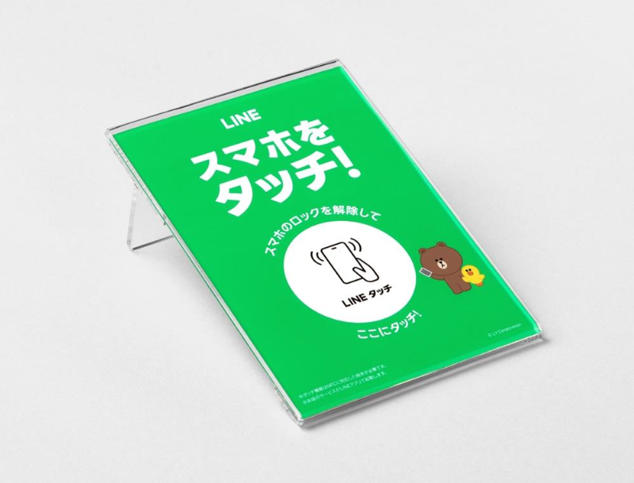
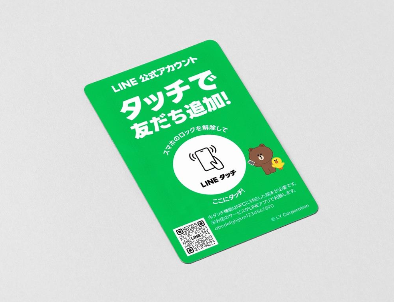
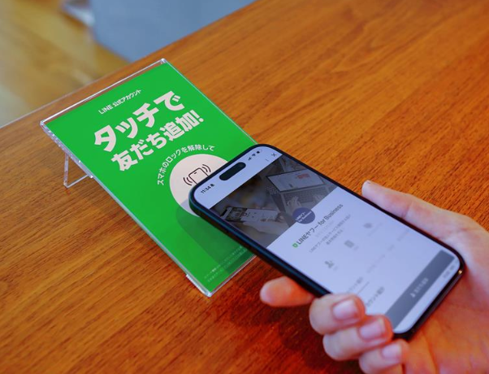
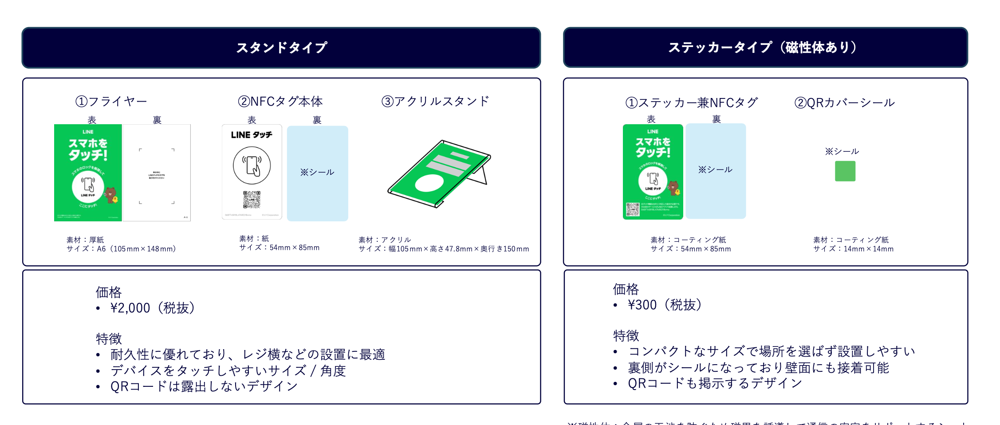
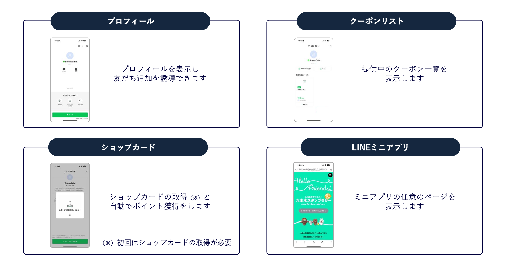
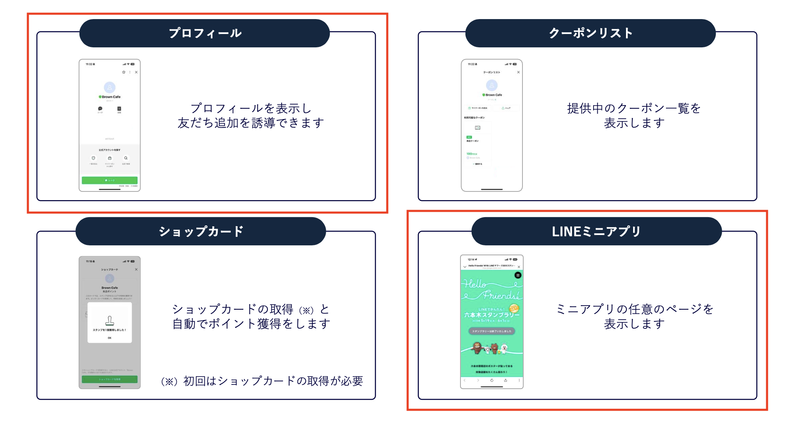
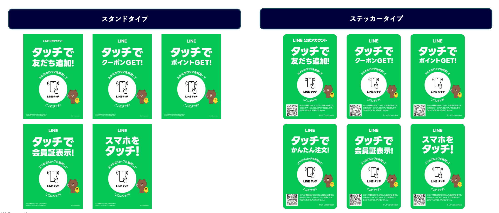
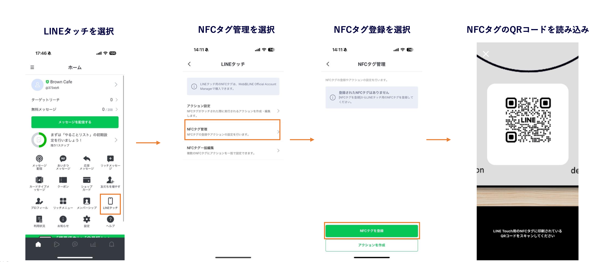

<!-- _class: title -->
<!-- _paginate: false -->

# 【本日リリース】LINE Touchの詳細と使い方について世界最速で解説！

## LINE Touchの世界を体験してみよう！

2025/11/17 LINEミニアプリ Tech Meetup #3

クラスメソッド株式会社 リテールアプリ共創部
高垣龍平

---

# 自己紹介

---

# 今日お話しすること

<!-- _class: align-center -->

## 1. LINE Touch概要
## 2. プロダクト詳細
## 3. 管理画面からの設定
## 4. 実際の体験デモ
## 8. まとめ

---

<!-- _class: section -->
<!-- _paginate: false -->

## **LINE Touchとは**

---

# 【本日リリース】LINE Touch

## **速報！2025年11月17日（本日）正式リリース🚀🚀**

### **LINE Touchとは**

<!-- _class: image -->

**NFCタグ**へスマホをタッチするだけで**LINE公式アカウント**や**ミニアプリ**へスムーズな遷移が可能
これまでのQRコードの読み取りに加え、オフラインの友だち獲得の起点となる、**新しいソリューション**として活用可能

---

# 体験イメージ

<!-- _class: image -->

https://x.com/ruonp24/status/1990024706834276662?s=20 のツイートに添付した動画を添付します。

---

<!-- _class: content-image-right -->

# LINE Touch体験の想定シナリオ

## **利用シーン**

- 飲食
- 美容・小売
- サービス・エンタメ

## **提供サービス**

- LINE公式アカウントのプロフィール表示
- クーポンリストの表示
- ショップカード起動
- LINEミニアプリの任意のページ表示

 

## **目指す世界**

**「店頭でスマホをタッチが当たり前の世界」**

サービス体験時にスマホをタッチする新しい習慣

---

# NFCの2つのメリット

### **① 立ち上げまでにかかる時間・工数の短縮**

| QRコード | LINE Touch |
|---------|------------|
| 1. スマホを起動 | 1. **タッチする** |
| 2. カメラアプリを立ち上げる | 2. **遷移完了** |
| 3. QRを読み取る| |
| 4. 遷移完了 | |
| **約15秒** | **約5秒** |

QR読み取りの面倒くささを解消。離脱率を下げミニアプリなど普及にも貢献

### **② 拡散による不正利用の防止**

NFCタッチの検証により、QRコードの撮影・拡散による**意図しない利用を防止**。
**確実に来店したユーザーのみ**に対してキャンペーンなどを実施可能。
従来は、QRコードが拡散される可能性がある前提で少額のキャンペーンなどを実施していたが、**より高額な賞品のキャンペーンなどが実施可能**。

---

# LINE Touchと自前NFCの違い

## **技術的には自前NFCも可能だが...**

<!-- _class: column-layout -->

### **🔧 自前NFC実装の課題**

#### **技術的複雑性**
- **NFC経由であることの自前検証**が必要
- セキュリティ実装の負担が大きい
- **デバイス互換性**の検証・対応が必要

#### **ユーザー体験の問題**
- **企業ごとに仕様が違う**とユーザーが戸惑う
- 動作が安定しない可能性
- 統一されたUXの提供が困難

### **✨ LINE Touchの優位性**

#### **統一されたブランド体験**
- **LINEブランド**による安心感と信頼性
- 全店舗・全サービスで**統一された操作感**

#### **普及による習慣化**
- ブランドとして普及することで**ユーザーが無意識的に**タッチ操作を習得
- 「タッチすればLINEが起動する」という**共通認識**の形成
- 日本全体でのNFC文化の醸成

---

<!-- _class: section -->
<!-- _paginate: false -->

## **プロダクト詳細**

---

<!-- _class: content-image -->

# 製品ラインナップ

スタンドタイプとステッカータイプの2タイプを展開
スタンドタイプは**2000円**、ステッカータイプは**300円**で販売。どちらも買い切りで**継続費用は0円**。

---
<!-- _class: content-image -->

# 設定できる遷移先

4つのオプションから選択可能

---

<!-- _class: content-image -->

# 今回のデモで設定した遷移先

スタンドタイプにLINEミニアプリを、ステッカータイプにプロフィール表示を設定。

---

<!-- _class: content-image -->

# 本体デザイン

フライヤーデザインは、下記6種類から選択可能

 

---

<!-- _class: section -->
<!-- _paginate: false -->

## **管理画面からの設定してみる**

---

# 管理画面からの設定

## **アクションの設定**

* LINE Touchの管理画面を共有。実際にPC上でLINE Official Account Managerからアクションを設定します。

---

<!-- _class: content-image -->

# LINE Official Account Managerスマホアプリの操作
## **NFCタグ設定（1/2）**

NFCタグとLINE公式アカウントを紐づけます。
LINE公式アカウント管理画面App版からQRコードを読み込む必要があります。

---

<!-- _class: content-image -->

# LINE Official Account Managerスマホアプリの操作
## **NFCタグ設定（2/2）**

タグの詳細を設定します。先ほどのアクションを紐付けます。

---

# 現物体験

<!-- _class: all-text-center align-center -->

## **📱 現物を持参しています！**

 

### **現地参加の方はLINE Touchを実際にタッチしてみください**

 

---

# まとめ

### **📱 NFCタッチでアプリ起動の新体験**
- **タッチするだけ**でLINEミニアプリが瞬時に起動。飲食店、美容院、小売店など**様々なサービス**での活用に期待

### **⚡ QRコードを超える体験価値**
- **QRより早くて体験が良い**直感的な操作。**ミニアプリの普及促進**に大きく貢献

### **💰 導入しやすい価格設定**
- **買い切り型**の安価な料金体系

### **🔒 安心のセキュリティ**
- LINEプラットフォームの**堅牢なセキュリティ**基盤。不正利用の防止

### **⚙️ 簡単な管理・運用**
- **管理画面から簡単設定**で誰でも運用可能。リアルタイムでの遷移先変更が可能

 

## →「店頭でスマホをタッチが当たり前の世界」の実現へ

---

<!-- _class: all-text-center align-center -->

# ご清聴ありがとうございました
