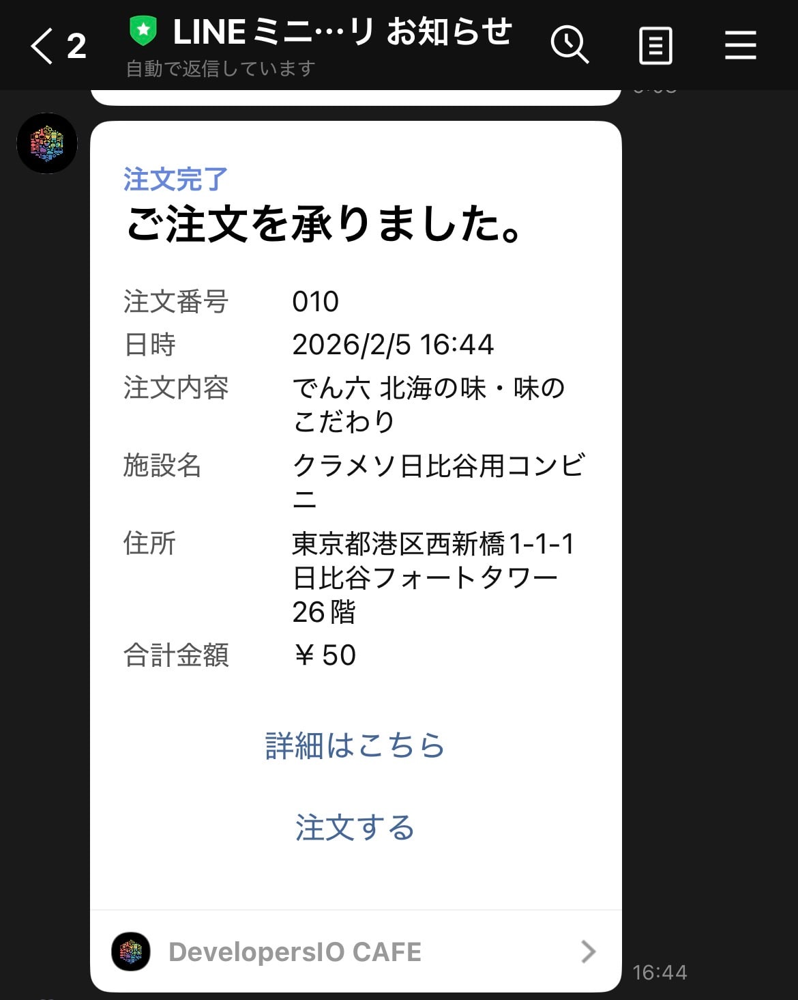
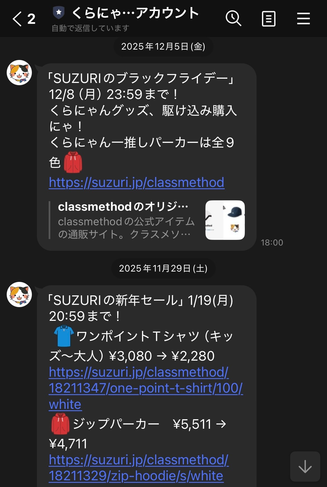
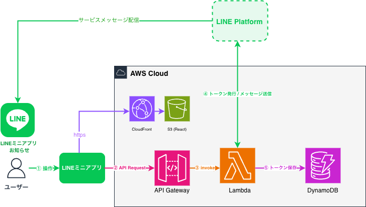
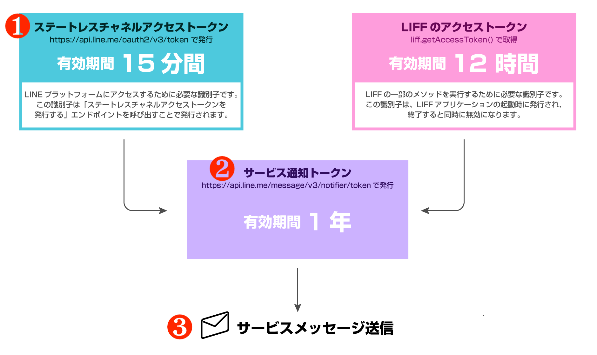
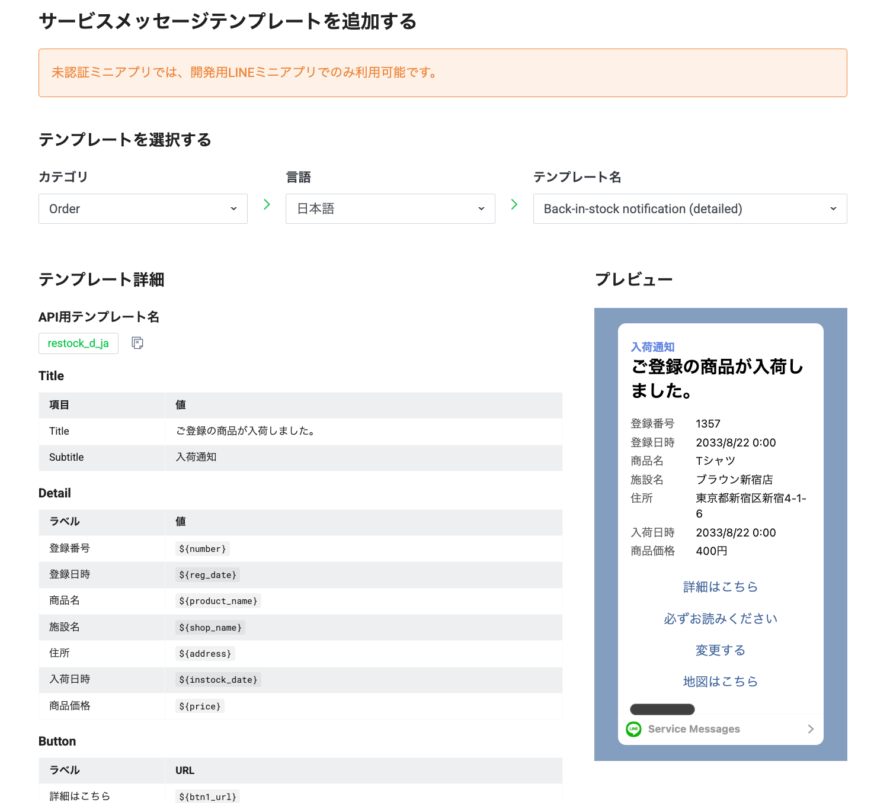

<!-- _class: title -->
<!-- _paginate: false -->


# LINEミニアプリで**サービスメッセージ**を送信してみよう

<center>

2026/03/13 LINEミニアプリ Tech Meetup #4

クラスメソッド株式会社 リテールアプリ共創部
高垣 龍平

</center>

---

# 自己紹介


---

# 今日お話しすること

<!-- _class: align-center -->

## 1. サービスメッセージとは
## 2. LINE公式アカウントからの配信との違い
## 3. 全体像
## 4. 実装してみた
## 5. 注意点・まとめ

---

<!-- _class: section -->
<!-- _paginate: false -->

## **サービスメッセージとは**

---

<!-- _class: content-image-right content-60 -->

# サービスメッセージとは



## ユーザーの操作に対する確認・応答として送信される**通知機能**

<br/>

### 例えば...
- 予約完了の通知
- リマインド
- 会員登録完了のお知らせ

<br/>

### 表示場所
LINEアプリ内の専用トークルーム
「**LINEミニアプリ お知らせ**」に表示される

<br/>

**認証済みのLINEミニアプリ専用**の機能

---

<!-- _class: section -->
<!-- _paginate: false -->

## **LINE公式アカウントからの配信との違い**

---

<!-- _class: small-text -->

# LINE公式アカウントからの配信との比較

<style scoped>
table {
  font-size: 0.95em;
  width: 100%;
}
th {
  background: #2C67E5 !important;
  color: white !important;
}
td:first-child {
  font-weight: 600;
  color: #1a365d;
  background: #f0f4f8;
}
</style>

| 項目 | サービスメッセージ | LINE公式アカウントからの配信 |
|:--|:--|:--|
| **料金** | 無料 | 従量課金制 |
| **送信回数制限** | 同一操作に対して最大5回まで | プランに応じた制限 |
| **メッセージ形式** | テンプレート形式のみ | 自由形式 |
| **表示場所** | 専用トークルーム（LINEミニアプリ お知らせ） | 公式アカウントのトーク |
| **対象** | 認証済みLINEミニアプリのみ | LINE公式アカウント |

---

# 配信先の違い

<!-- _class: image -->

<style scoped>
table {
  margin: 0 auto;
  width: auto;
}
</style>

| サービスメッセージ | LINE公式アカウントからの配信 |
|:---:|:---:|
|  |  |
| 専用トークルーム「LINEミニアプリ お知らせ」 | 公式アカウントのトーク |

---

# サービスメッセージの**4つの特徴**

<style scoped>
.feature-grid {
  display: grid;
  grid-template-columns: 1fr 1fr;
  gap: 16px;
  margin-top: 16px;
}
.feature-card {
  background: #f8f9fa;
  border-radius: 12px;
  padding: 20px;
  border-left: 4px solid #2C67E5;
}
.feature-card.green {
  border-left-color: #00897B;
}
.feature-card.green h3 {
  color: #00897B;
}
.feature-card.orange {
  border-left-color: #FF9800;
}
.feature-card.orange h3 {
  color: #FF9800;
}
.feature-card.pink {
  border-left-color: #E91E63;
}
.feature-card.pink h3 {
  color: #E91E63;
}
.feature-card h3 {
  color: #2C67E5;
  font-size: 1em;
  margin: 0 0 8px 0;
}
.feature-card p {
  margin: 0;
  font-size: 0.85em;
  color: #555;
}
</style>

<div class="feature-grid">

<div class="feature-card">

### 1. 無料で利用可能
<p>LINE公式アカウントからの配信は送信数に応じて課金されるが、サービスメッセージは<strong>無料</strong></p>

</div>

<div class="feature-card green">

### 2. 送信回数の制限
<p>同じ操作に対して<strong>最大5回まで</strong>。スパム的な利用を防止</p>

</div>

<div class="feature-card orange">

### 3. テンプレート形式
<p>LINEヤフー社が提供する<strong>審査済みテンプレート</strong>を使用。ユーザー体験の一貫性を担保</p>

</div>

<div class="feature-card pink">

### 4. ブロック中でも送信可能
<p>LINE公式アカウントがブロックされていても、専用トークルーム「LINEミニアプリ お知らせ」に<strong>配信可能</strong></p>

</div>

</div>

---

<!-- _class: section -->
<!-- _paginate: false -->

## **全体像**

---

<!-- _class: content-image -->

# システムアーキテクチャ

- **フロントエンド**：React + TypeScript（S3 + CloudFront）
- **バックエンド**：Express.js + TypeScript（Lambda + API Gateway）
- **データベース**：DynamoDB

フロントエンドのLINEミニアプリから**LIFFアクセストークン**を含めてAPIリクエストを送信し、バックエンドで**サービス通知トークンの発行**と**サービスメッセージの送信**を行う



---

<!-- _class: section -->
<!-- _paginate: false -->

## **実装してみた**

---

# サービスメッセージ送信の**3ステップ**

<style scoped>
.step-flow {
  display: flex;
  gap: 12px;
  margin-top: 20px;
  align-items: stretch;
}
.step-card {
  flex: 1;
  background: #f8f9fa;
  border-radius: 12px;
  padding: 20px;
  border-top: 4px solid #2C67E5;
  text-align: center;
}
.step-card.green {
  border-top-color: #00897B;
}
.step-card.orange {
  border-top-color: #FF9800;
}
.step-card h2 {
  font-size: 0.95em;
  margin: 0 0 8px 0;
}
.step-card p {
  font-size: 0.8em;
  margin: 4px 0;
  color: #555;
}
.step-card code {
  font-size: 0.7em;
}
.arrow {
  display: flex;
  align-items: center;
  font-size: 1.5em;
  color: #666;
}
</style>

<div class="step-flow">
  <div class="step-card">
    <h2>Step 1</h2>
    <p><strong>チャネルアクセストークン</strong>の発行</p>
    <p><code>POST /oauth2/v3/token</code></p>
  </div>
  <div class="arrow">→</div>
  <div class="step-card green">
    <h2>Step 2</h2>
    <p><strong>サービス通知トークン</strong>の発行</p>
    <p><code>POST /message/v3/notifier/token</code></p>
  </div>
  <div class="arrow">→</div>
  <div class="step-card orange">
    <h2>Step 3</h2>
    <p><strong>サービスメッセージ</strong>の送信</p>
    <p><code>POST /message/v3/notifier/send</code></p>
  </div>
</div>

<br/>

### 事前準備
1. LINE Developersコンソールで**チャネルID**・**チャネルシークレット**を取得
2. **サービスメッセージテンプレート**を登録
3. **LIFFアプリ**の設定確認

---

<!-- _class: content-image -->

# 処理の流れ（公式ドキュメントより）

サービスメッセージの送信には、**ステートレスチャネルアクセストークン**と**LIFFアクセストークン**の2つが必要



---

<!-- _class: content-image-right content-60 image-shadow -->

# 事前準備：テンプレートの登録



## LINE Developersコンソールでの設定

### 手順
1. 対象チャネルの「サービスメッセージ」タブを開く
2. 「テンプレートを追加」をクリック
3. テンプレートカテゴリを選択
4. テンプレートの言語を選択（6言語対応）
5. テンプレート名を設定

### ポイント
- テンプレートは**LINEヤフー社が用意**したものを使用
- テンプレート内の変数（`${number}`, `${reg_date}`等）にはAPI呼び出し時に**任意の値を設定可能**

---

<!-- _class: small-text -->

# フロントエンド実装（React）

## LIFFアクセストークンをバックエンドに送信

```typescript
const sendServiceMessage = async (params: Record<string, string>) => {
  const liffAccessToken = liff.getAccessToken();

  if (!liffAccessToken) {
    throw new Error("LIFFアクセストークンが取得できませんでした");
  }

  const response = await fetch("https://your-api-endpoint.com/send-message", {
    method: "POST",
    headers: {
      "Content-Type": "application/json",
      "X-LIFF-Access-Token": liffAccessToken,
    },
    body: JSON.stringify({ params }),
  });

  return response.json();
};
```

### ポイント
`liff.getAccessToken()` で取得したLIFFアクセストークンを `X-LIFF-Access-Token` ヘッダーに設定

---

<!-- _class: small-text -->

# バックエンド実装：全体の流れ

## Lambda関数のハンドラー概要

```typescript
export const handler = async (event: APIGatewayProxyEvent) => {
  const liffAccessToken = event.headers["x-liff-access-token"];
  const { userId, params } = JSON.parse(event.body || "{}");

  // 1. チャネルアクセストークンを発行
  const channelAccessToken = await getChannelAccessToken();

  // 2. サービス通知トークンを発行
  const tokenResponse = await issueServiceNotificationToken(
    channelAccessToken, liffAccessToken
  );

  // 3. サービスメッセージを送信
  const sendResponse = await sendServiceMessage(
    channelAccessToken, tokenResponse.notificationToken,
    TEMPLATE_NAME, params
  );

  // 4. サービス通知トークンをDBに保存（再利用のため）
  await tokenRepository.save({
    userId, notificationToken: sendResponse.notificationToken,
    remainingCount: sendResponse.remainingCount,
  });
};
```

---

# Step 1：チャネルアクセストークンの発行

## LINE APIを呼び出すために必要なトークンを発行

```
POST https://api.line.me/oauth2/v3/token
```

```typescript
const getChannelAccessToken = async (): Promise<string> => {
  const response = await fetch("https://api.line.me/oauth2/v3/token", {
    method: "POST",
    headers: {
      "Content-Type": "application/x-www-form-urlencoded",
    },
    body: `grant_type=client_credentials&client_id=${CHANNEL_ID}&client_secret=${CHANNEL_SECRET}`,
  });

  const data = await response.json();
  return data.access_token;
};
```

### ポイント
- **チャネルID**と**チャネルシークレット**は環境変数から読み込み

---

<!-- _class: small-text -->

# Step 2：サービス通知トークンの発行

## LIFFアクセストークンとチャネルアクセストークンで発行

```
POST https://api.line.me/message/v3/notifier/token
```

```typescript
const issueServiceNotificationToken = async (
  channelAccessToken: string, liffAccessToken: string
) => {
  const response = await fetch("https://api.line.me/message/v3/notifier/token", {
    method: "POST",
    headers: {
      "Content-Type": "application/json",
      Authorization: `Bearer ${channelAccessToken}`,
    },
    body: JSON.stringify({ liffAccessToken }),
  });
  return await response.json();
};
```

### レスポンスの内容
- `notificationToken`：メッセージ送信に使用するトークン
- `expiresIn`：トークンの有効期限（最大**1年間**有効）
- `remainingCount`：残り送信可能回数（最大**5回**）

---

<!-- _class: small-text -->

# Step 3：サービスメッセージの送信

## サービス通知トークンを使用してメッセージを送信

```
POST https://api.line.me/message/v3/notifier/send?target=service
```

```typescript
const sendServiceMessage = async (
  channelAccessToken: string, notificationToken: string,
  templateName: string, params: Record<string, string>
) => {
  const response = await fetch(
    "https://api.line.me/message/v3/notifier/send?target=service",
    {
      method: "POST",
      headers: {
        "Content-Type": "application/json",
        Authorization: `Bearer ${channelAccessToken}`,
      },
      body: JSON.stringify({ notificationToken, templateName, params }),
    }
  );
  return await response.json();
};
```

### ポイント
- `templateName`：LINE Developersコンソールで設定した**テンプレート名**を指定
- `params`：テンプレート内の変数に渡す値を設定

---

# Step 4：サービス通知トークンの保存

## 送信後のレスポンスに含まれるトークンをDynamoDBに保存

<style scoped>
.save-box {
  background: linear-gradient(135deg, #e3f2fd 0%, #bbdefb 100%);
  border-left: 5px solid #2C67E5;
  border-radius: 0 12px 12px 0;
  padding: 24px 32px;
  margin: 20px 0;
}
</style>

<div class="save-box">

### なぜ保存するのか？

同じLIFFアクセストークンで `issueServiceNotificationToken` を呼べるのは**1回だけ**。
次回以降のメッセージ送信では、保存した `notificationToken` を**再利用**する必要がある。

</div>

### 保存する情報
- `userId`：ユーザーの識別子
- `notificationToken`：次回送信に使うトークン
- `remainingCount`：残り送信可能回数

---

<!-- _class: section -->
<!-- _paginate: false -->

## **認証済みミニアプリと未認証ミニアプリ**

---

# 開発環境では**未認証でもテスト可能**

<!-- _class: column-layout -->

<style scoped>
.column {
  background: #f8f9fa;
  border-radius: 12px;
  padding: 20px;
  margin: 0 8px;
}
.column h2 {
  font-size: 0.95em;
  margin-bottom: 12px;
  padding-bottom: 8px;
}
.column.left h2 {
  border-bottom: 3px solid #2C67E5;
  color: #2C67E5;
}
.column.right h2 {
  border-bottom: 3px solid #00897B;
  color: #00897B;
}
.column ul {
  font-size: 0.85em;
}
.column li {
  padding: 4px 0;
}
</style>

<div class="column left">

## 本番環境（認証済み）
- LINEヤフー社による**審査が必要**
- 審査には数日〜数週間
- 実際のユーザーに送信可能
- テンプレートも審査通過が必須

</div>

<div class="column right">

## 開発環境（未認証）
- **審査なし**で実装・テスト可能
- 開発者・テスターにのみ送信
- 本番リリース前に動作確認
- テンプレートのテストも可能

</div>

---

<!-- _class: h2-text-blue -->

# 開発の進め方

<style scoped>
.flow-box {
  background: linear-gradient(135deg, #e8f5e9 0%, #c8e6c9 100%);
  border-left: 5px solid #00897B;
  border-radius: 0 12px 12px 0;
  padding: 24px 32px;
  margin: 20px 0;
}
</style>

<div class="flow-box">

## 審査を待たずに、先に実装を完了させることが可能

```
1. 開発環境で実装・テスト（未認証ミニアプリ）
   └─ 審査なしで動作確認

2. 実装完了後に審査を申請

3. 審査通過後に本番環境へデプロイ
```

</div>

<br/>

「**審査に通るまで実装できない**」という心配は不要

---

<!-- _class: section -->
<!-- _paginate: false -->

## **注意点**

---

<!-- _class: small-text -->

# 実装時の注意点

<style scoped>
.note-grid {
  display: grid;
  grid-template-columns: 1fr 1fr;
  gap: 12px;
  margin-top: 12px;
}
.note-card {
  background: #f8f9fa;
  border-radius: 12px;
  padding: 16px;
  border-left: 4px solid #DF3756;
}
.note-card h3 {
  color: #DF3756;
  font-size: 0.9em;
  margin: 0 0 8px 0;
}
.note-card p {
  margin: 0;
  font-size: 0.8em;
  color: #555;
}
</style>

<div class="note-grid">

<div class="note-card">

### 1. 本番環境では認証済みが必須
<p>実際のユーザーへの送信には審査通過が必須。開発環境では未認証でも動作確認は可能</p>

</div>

<div class="note-card">

### 2. テンプレートの事前登録
<p>使用するテンプレートはLINE Developersコンソールで事前登録・審査通過が必要。チャネルごとに<strong>最大20個</strong>まで</p>

</div>

<div class="note-card">

### 3. 送信回数の制限
<p>同一操作に対して<strong>最大5回</strong>まで。<code>remainingCount</code>を確認して残り送信可能回数を把握</p>

</div>

<div class="note-card">

### 4. サービス通知トークンの再利用
<p>同じLIFFアクセストークンでトークン発行APIを呼べるのは<strong>1回だけ</strong>。レスポンスのトークンを再利用</p>

</div>

<div class="note-card">

### 5. ユーザーアクションが起点
<p>ユーザーがミニアプリ上で行った操作に対してのみ送信可能。バッチ処理や外部からの一方的な通知には<strong>使用不可</strong></p>

</div>

<div class="note-card">

### 6. プロモーション送信は禁止
<p>値下げやプロモーション情報の送信は<strong>禁止</strong>。ユーザー操作に対する確認・応答のみ</p>

</div>

</div>

---

# まとめ

<style scoped>
.summary-item {
  background: #f8f9fa;
  border-radius: 8px;
  padding: 12px 20px;
  margin: 8px 0;
  border-left: 4px solid #2C67E5;
}
.summary-item h3 {
  color: #2C67E5;
  font-size: 0.95em;
  margin: 0 0 4px 0;
}
.summary-item.green {
  border-left-color: #00897B;
}
.summary-item.green h3 {
  color: #00897B;
}
.summary-item.orange {
  border-left-color: #FF9800;
}
.summary-item.orange h3 {
  color: #FF9800;
}
.summary-item p {
  margin: 0;
  font-size: 0.85em;
  color: #555;
}
</style>

<div class="summary-item">

### サービスメッセージは無料で送信できる通知機能
<p>LINE公式アカウントの従量課金メッセージと比べ、<strong>無料</strong>で利用可能。ブロック中でも配信できる</p>

</div>

<div class="summary-item green">

### 3ステップで実装可能
<p>チャネルアクセストークン → サービス通知トークン → メッセージ送信 の流れで実装</p>

</div>

<div class="summary-item orange">

### 用途に応じた使い分けが重要
<p>テンプレート形式のみ・送信回数制限あり。予約通知やリマインドなど<strong>ユーザーにとって重要な情報</strong>を伝える場面で活用</p>

</div>

<br/>

### 参考リンク
- [サービスメッセージ - LINE Developers](https://developers.line.biz/ja/docs/line-mini-app/develop/service-messages/)
- [サービス通知トークン発行 API](https://developers.line.biz/ja/reference/line-mini-app/#issue-notification-token)
- [サービスメッセージ送信 API](https://developers.line.biz/ja/reference/line-mini-app/#send-service-message)

---

<!-- _class: all-text-center align-center -->


# ご清聴ありがとうございました
