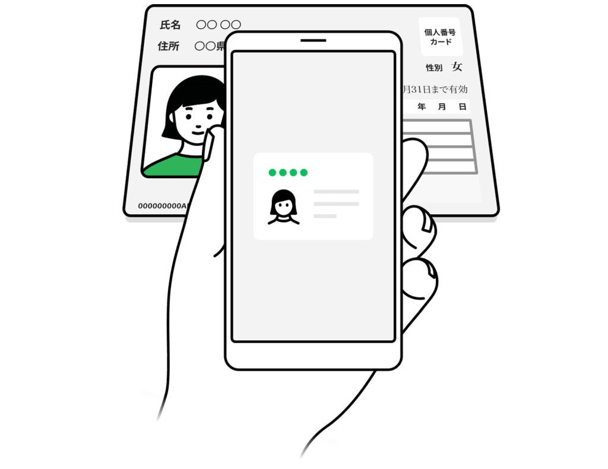
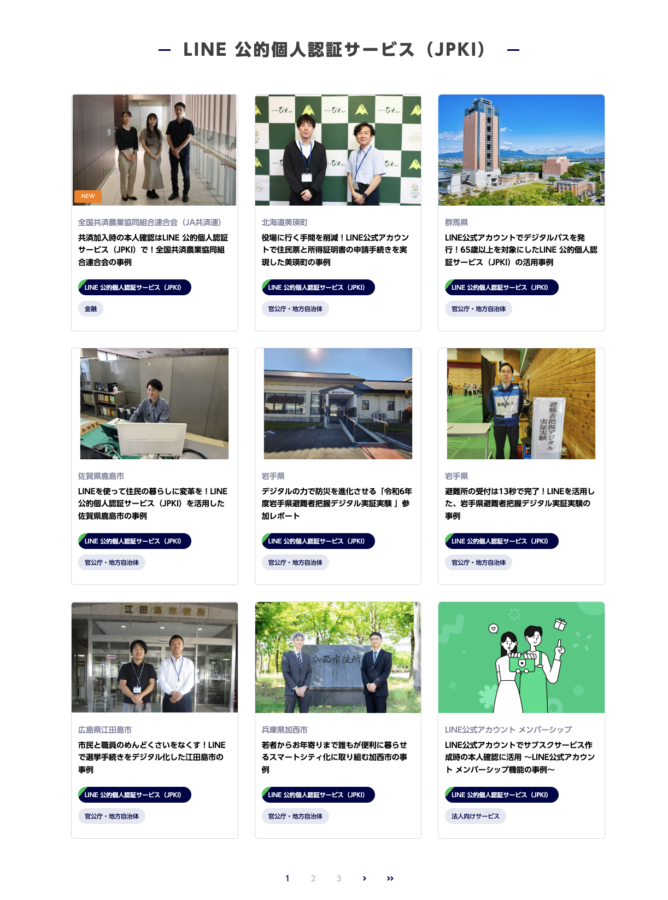
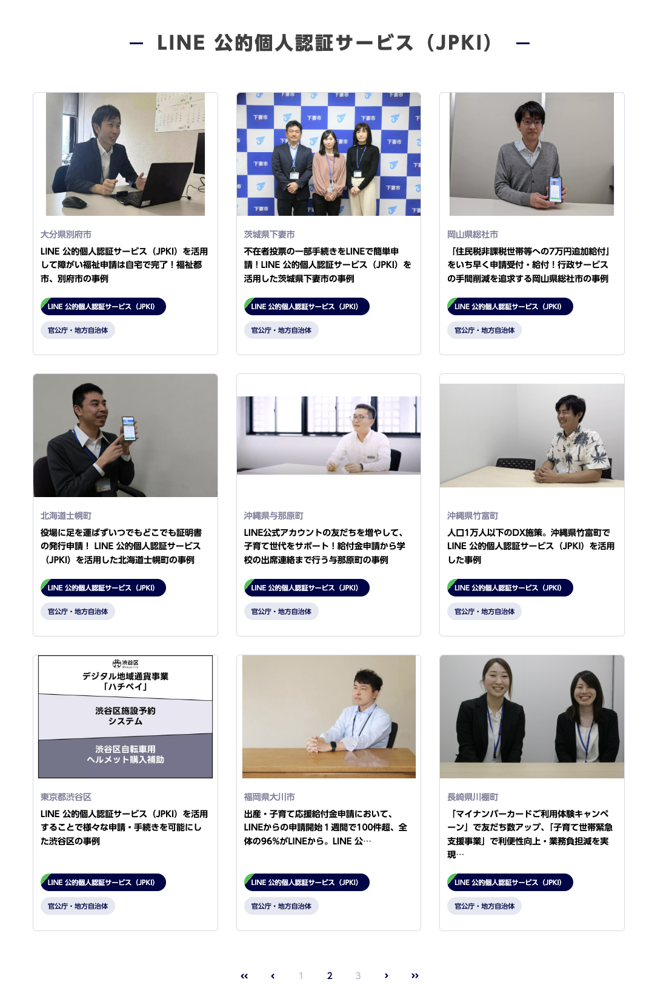
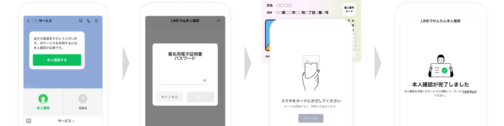

<!-- _class: title -->

# LINEミニアプリでのJPKIユースケースのご紹介

2025/07/28
LINEミニアプリ Tech Meetup #2  
クラスメソッド株式会社 リテールアプリ共創部
高垣龍平

---

# 自己紹介

---

# 今日お話しすること

1. JPKIとは
2. LINE 公的個人認証サービスの概要
3. 開発について
4. デモ動画
5. LINEミニアプリでの活用ユースケース
6. まとめ

---

# JPKI（公的個人認証サービス）とは

## **Japanese Public Key Infrastructure**の略

公的個人認証サービスとは、マイナンバーカードなどに搭載された電子証明書を用いて、ネット上におけるなりすましや改ざんを防ぎ、インターネットを通じて安全・確実な手続きを行えるための機能のことを示します。

## 主な特徴
- マイナンバーカードのICチップに搭載された電子証明書を利用
- オンラインで利用者本人の認証や文書の改ざん確認を公的に行う
- 行政機関だけでなく民間事業者でも利用可能

## こんなところで見かけていませんか？
- 市役所・区役所の専用端末
- コンビニのコピー機での住民票発行
- スマートフォンでのマイナンバーカード読み取り

---

# JPKIの特徴

## 安全な本人確認
- マイナンバーカードのICチップに記録された電子証明書を利用し、オンラインで本人確認を安全に行うことが可能

## 申請手続きの効率化
- 本人確認書類や申込書の記入・郵送が不要
- 24時間365日いつでも申請可能
- 時間や場所の制約が少ないサービス提供

## 事務コスト削減
- 書類の受付・審査業務の負担軽減
- 記入不備による再送付依頼の削減
- 郵送コストの削減

---

# LINE 公的個人認証サービスとは

<!-- _class: column-layout -->

## サービス概要
- LINE上で簡単にJPKIを利用できるサービス
- LINEアプリとマイナンバーカードで手軽に本人確認

## 対象業務
- オンライン行政手続き
- 企業の本人確認業務
- 各種証明書の交付申請
- 金融口座開設
など...

---
# 事例

<!-- _class: column-layout -->

---

# ユーザー利用フロー

## 4つのステップで完了

1. **企業・自治体のLINE公式アカウントのリッチメニューやLINEミニアプリから申請**
2. **マイナンバーカードの署名用電子証明書パスワードを入力**
3. **スマートフォンをマイナンバーカードにかざしてスキャン**
4. **本人確認終了**

---

# LINE上でJPKIをやるメリット

### ユーザー目線
- 本人確認書類や申込書の記入・郵送が不要
- 24時間365日いつでも申請可能
- 時間や場所の制約がないサービス提供
- 使い慣れたLINEアプリで本人確認が完結
- 専門アプリのインストールが不要
- 結果や通知、やり取りなどがLINE上で実施できる

### 組織担当者目線
- 業務の効率化を実現
- 離脱率の低減
- LINEでのJPKI導入により公式アカウントとの接点が生まれ、継続的なコミュニケーションが可能に

---
# 組織のDXとしての価値

## **ユーザー側の手間削減だけではない**
 

LINEミニアプリのメリットはユーザー側や企業のデータ活用などの目線で語られることが多いが、**地方自治体や金融などの多大な量の申請書を捌かないといけない業務**においては、LINE上でのJPKI導入自体が**組織にとってのDX**になっているという視点も重要

---

# 開発

## 申請・承認フロー
1. **LINEヤフー株式会社への申請**
2. **Sandbox環境の利用申請**
3. **テスター登録**
4. **テスト環境での開発・検証**

 

## 注意事項
- APIドキュメントの詳細は非公開
- 承認されたパートナーのみアクセス可能

---

# 開発時の考慮事項

## セキュリティ要件
- 公的個人認証法に基づく厳格な要件
- データ保護・プライバシー配慮
- 不正アクセス対策の実装

 

## ユーザビリティ
- 直感的なUI/UX設計
- 高齢者・デジタル初心者への配慮

---

<!-- _class: section -->

## デモ動画
サンドボックス環境でのデモ動画
---

# 実際の利用シーン

*※実際のデモ動画をここに挿入*

---

# LINEミニアプリでのユースケース

## **自治体向けアプリ**
- **住民向けサービスアプリ**: 各種証明書申請、行政手続き
- **子育て支援アプリ**: 保育園申込み、給付金申請
- **防災・避難所管理アプリ**: 避難所受付、安否確認
- **地域通貨・ポイントアプリ**: 地域通貨の発行・利用

## **企業向けアプリ**
- **金融サービスアプリ**: 口座開設、ローン申込み
- **不動産・賃貸アプリ**: 賃貸契約時の本人確認
- **イベント・チケット予約アプリ**: 本人確認が必要なチケット予約

---

# LINEミニアプリでのユースケース（続き）

## **業界特化型アプリ**
- **医療・健康管理アプリ**: オンライン診療、処方箋管理
- **教育・資格管理アプリ**: 資格試験申込み、証明書発行
- **人材派遣・求職アプリ**: 登録時の本人確認
- **シェアリングエコノミーアプリ**: 車両・施設利用時の本人確認

## **その他の活用例**
- **会員制サービスアプリ**: プレミアム会員登録
- **年齢制限サービスアプリ**: 年齢確認が必要なサービス
- **公的資格・免許管理アプリ**: デジタル免許証連携

---

# まとめ

## LINEミニアプリ × JPKI の価値

### **ユーザー体験の向上**
- アプリのインストールが不要で、使い慣れたLINEアプリで完結する本人確認
- 書類準備・郵送の手間を完全に削減
- 24時間365日、場所を選ばない申請手続き

### **組織のDX推進**
- 申請受付・審査業務の大幅な効率化
- 記入不備や再送付対応の削減
- 公式アカウントと連携することで、継続的なユーザーコミュニケーション基盤の構築

### **今後の展望**
- 現在自治体などがメインでの利用されているが、今後民間企業などにも取り入れて、LINEミニアプリ内での本人確認機能を持ったサービスが増えていくことに期待。

---

<!-- _class: section -->

# ご清聴ありがとうございました

