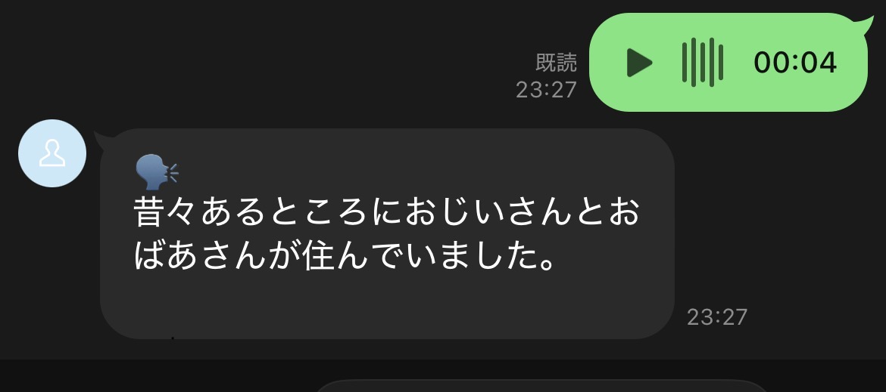
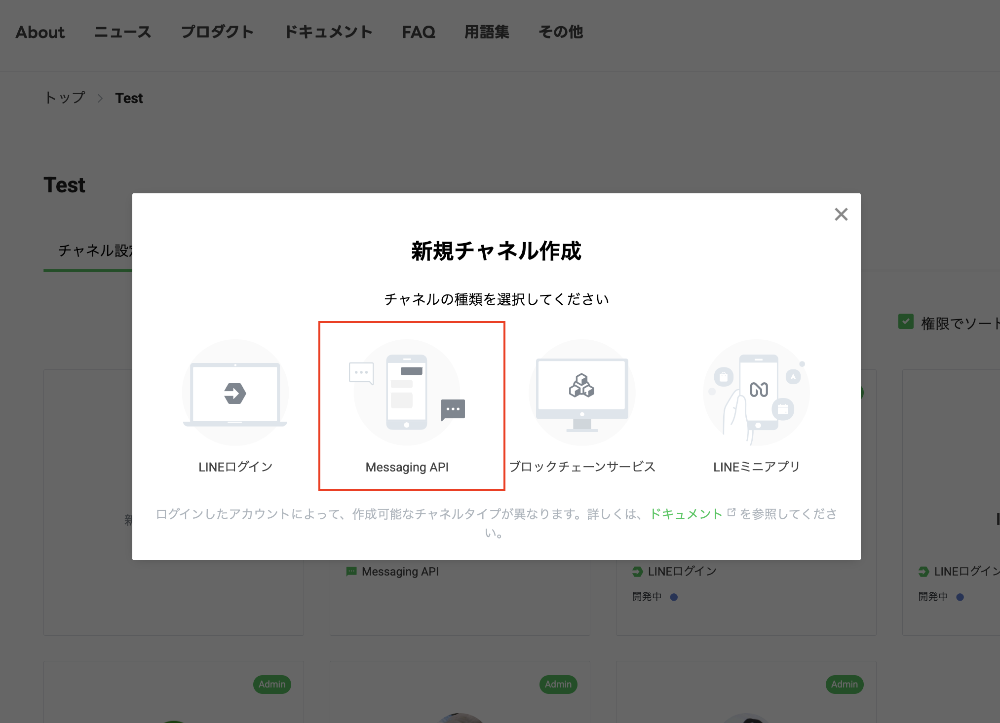
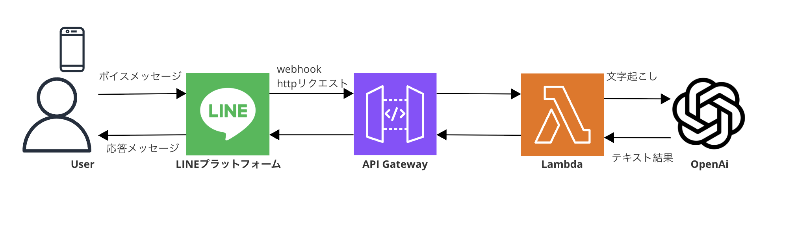

<!-- _class: title -->


# LINE Messaging API × OpenAI APIで入力音声の文字起こしBot作ってみた

<center>

2025/6/18「LINE DC Generative AI Meetup #6」

クラスメソッド株式会社 リテールアプリ共創部 高垣龍平

</center>

---

# 自己紹介


---

# 今日お話しすること

- **実際の動作デモ**

- **LINE Messaging APIのWebhookとは？**

- **OpenAI APIの音声文字起こし機能**

- **システム全体のアーキテクチャ**

- **AWS CDKを使ったインフラ構成**

- **サーバーサイドの実装詳細**
---

# 試してみてください


<center>



</center>


---
<!-- _class: show-qr -->
# Bot作成手順

### 必要な設定項目（LINE Developers Console）
1. **公式アカウントの作成**
2. **LINE Messaging APIの有効化**
3. **Webhook URLの指定**: `https://your-domain.com/webhook`
2. **必要情報の取得**: チャネルアクセストークン・チャネルシークレット取得
<br/>
<center>



</center>


---
<!-- _class: show-qr -->
# LINE Messaging APIのWebhookとは？

### Webhookとは？
ユーザーが、LINE公式アカウントを友だち追加したり、LINE公式アカウントにメッセージを送ったりすると、LINE Developersコンソールの「Webhook URL」に指定したURL（ボットサーバー）に対して、LINEプラットフォームからWebhookイベントオブジェクトを含むHTTP POSTリクエストが送られます。（https://developers.line.biz/ja/docs/messaging-api/receiving-messages/ ）


### 主要なイベントタイプ
- **`message`: テキスト、画像、音声、動画メッセージ**
- `follow`: 友だち追加
- `unfollow`: ブロック
- `postback`: リッチメニューやボタンのタップ


---
<!-- _class: show-qr -->
# OpenAI API Speech to Text
### 概要
音声をテキストに変換するAPIです。https://platform.openai.com/docs/guides/speech-to-text

- **transcriptions**: 音声ファイルをテキストに変換（**文字起こし**）します。
- **translations**: 音声ファイルを**翻訳**します。

### 今回使用するAPI 
- **Create transcription**: https://platform.openai.com/docs/api-reference/audio/createTranscription
- **Endpoint**: `Post https://api.openai.com/v1/audio/transcriptions`

### モデル
 - `gpt-4o-transcribe`,
 - `gpt-4o-mini-transcribe`
 - `whisper-1`

---
<!-- _class: show-qr -->

# OpenAI Speech Text API実装例
OpenAIのNode.jsのSDKを使用して実装してみるとこんな感じ。
https://github.com/openai/openai-node
```typescript
import fs from "fs";
import OpenAI from "openai";

const openai = new OpenAI();

async function main() {
  const transcription = await openai.audio.transcriptions.create({
    file: fs.createReadStream("audio.mp3"),
    model: "gpt-4o-transcribe",
  });

  console.log(transcription.text);
}
main();

```

---
<!-- _class: show-qr -->

# システム全体のアーキテクチャ
### 処理フロー
1. ユーザーがボイスメッセージを送信
2. LINE PlatformがWebhookでAmazon API Gatewayのエンドポイントに通知
3. AWS Lambdaが音声データを取得
4. OpenAI APIで文字起こし実行
5. 結果をLINEに返信

<center>


</center>

---
<!-- _class: show-qr -->

# プロジェクト構成
### 各ディレクトリの役割
- **infra**: インフラ定義（AWS CDK）
- **server**: バックエンド（ロジック実装）
<br />
```
line-transcriptions-bot/
├── infra/          # AWS CDKインフラ定義
│   ├── lib/
│   │   └── infra-stack.ts
│   ├── bin/
│   │   └── infra.ts
│   └── config.ts
├── server/         #関数処理実装
│   ├── src/
│   │   ├── index.ts
│   │   └── services/
│   │       └── openai.ts
└── └── package.json

```


---
<!-- _class: show-qr -->

# AWS CDKインフラ構成（/infra）
```typescript
export class InfraStack extends cdk.Stack {
  constructor(scope: Construct, id: string, props: InfraStackProps) {
    super(scope, id, props);

    // Lambda関数の作成
    const lineTranscriptionLambda = new NodejsFunction(this, 'LineTranscriptionFunction', {
      runtime: lambda.Runtime.NODEJS_LATEST,
      entry: '../server/src/index.ts',
      handler: 'handler',
      timeout: cdk.Duration.seconds(30),
      environment: {
        LINE_CHANNEL_ACCESS_TOKEN: props.config.LINE_CHANNEL_ACCESS_TOKEN,
        LINE_CHANNEL_SECRET: props.config.LINE_CHANNEL_SECRET,
        OPENAI_API_KEY: props.config.OPENAI_API_KEY,
      },
    });

    // API Gatewayの作成
    const api = new apigateway.RestApi(this, 'LineTranscriptionApi', {
      restApiName: 'LINE Transcription Bot API',
      description: 'LINE音声文字起こしBot用のAPI Gateway',
      defaultCorsPreflightOptions: {
        allowOrigins: apigateway.Cors.ALL_ORIGINS,
        allowMethods: apigateway.Cors.ALL_METHODS,
      },
    });

    // Webhookエンドポイントの作成
    const webhookIntegration = new apigateway.LambdaIntegration(lineTranscriptionLambda);
    // https://my-domain.com/webhook にPOSTリクエストを受け付ける
    api.root.addResource('webhook').addMethod('POST', webhookIntegration);
  }
}
```

---
<!-- _class: show-qr -->

# Lambda関数の実装（/server）
`line-bot-sdk-nodejs`を使用して実装
https://github.com/line/line-bot-sdk-nodejs

```typescript
export const handler = async (
  event: APIGatewayProxyEvent
): Promise<APIGatewayProxyResult> => {
    // 署名検証
    const signature = event.headers[LINE_SIGNATURE_HTTP_HEADER_NAME]
    if (!validateSignature(event.body!, LINE_CHANNEL_SECRET, signature!)) {
      return { statusCode: 403, body: 'Invalid signature' };
    }

    // Webhookイベントの解析
    const webhookEvents: WebhookEvent[] = JSON.parse(event.body!).events;

    // 音声メッセージのみ処理
    await Promise.all(
      webhookEvents.map(async (webhookEvent) => {
        if (webhookEvent.type === 'message' && webhookEvent.message.type === 'audio') {
          await handleAudioMessage(webhookEvent);
        }
      })
    );

    return { statusCode: 200, body: JSON.stringify({ message: 'OK' }) };
};
```

---
<!-- _class: show-qr -->

# 音声を処理してLINEに応答メッセージを投げる

```typescript
const client = new messagingApi.MessagingApiClient({
  channelAccessToken: LINE_CHANNEL_ACCESS_TOKEN,
}); 

const blobClient = new messagingApi.MessagingApiBlobClient({
  channelAccessToken: LINE_CHANNEL_ACCESS_TOKEN,
});
// ...省略
async function handleAudioMessage(event: MessageEvent) {
    const messageId = event.message.id;
    const replyToken = event.replyToken;

    // LINEから音声データを取得
    const audioStream = await blobClient.getMessageContent(messageId);
    
    // 音声データをバッファに変換
    const audioBuffer = await streamToBuffer(audioStream);
    
    // OpenAI APIで文字起こし
    const transcription = await transcribeAudio(audioBuffer);

    // 結果をLINEに返信
    await client.replyMessage({
      replyToken: replyToken,
      messages: [{
        type: 'text',
        text: `🗣️\n${transcription}`,
      }]
    });
}
```

---
<!-- _class: show-qr -->

# Open AIで文字起こし実装
OpenAIのNode.jsのSDKを使用して実装
https://github.com/openai/openai-node

### 音声形式の自動判定

```typescript
const openai = new OpenAI({
  apiKey: process.env.OPENAI_API_KEY!,
});

export async function transcribeAudio(audioBuffer: Buffer): Promise<string> {
    // 最初にM4A形式で試行
    const audioFile = await toFile(audioBuffer, 'audio.m4a', { type: 'audio/m4a' });
    const transcription = await openai.audio.transcriptions.create({
      file: audioFile,
      model: 'gpt-4o-transcribe',
      response_format: 'text',
      language: 'ja',
    });
    return transcription;
}
```

---
<!-- _class: show-qr -->
# 完成！
LINEから音声の文字起こしが可能に


<center>


</center>


---
<!-- _class: show-qr -->

# まとめ

### 構築したシステム
- **LINE Messaging API**: Webhook機能でリアルタイム通信
- **OpenAI Speech to Text API**: 高精度音声文字起こし
- **AWS サーバーレス環境**: Lambda + API Gatewayで運用コスト最適化

<br/>

### 機能アイデア
- **要約機能**: 文字起こし結果の自動要約
- **翻訳機能**: 他言語への翻訳
- **会話ボット**: 音声に対するAIとの会話機能

---
<!-- _class: show-qr -->

# 参考
- [LINE Messaging API Documentation](https://developers.line.biz/ja/docs/messaging-api/)
- [OpenAI API Documentation](https://platform.openai.com/docs)
- [AWS CDK Documentation](https://docs.aws.amazon.com/cdk/)
