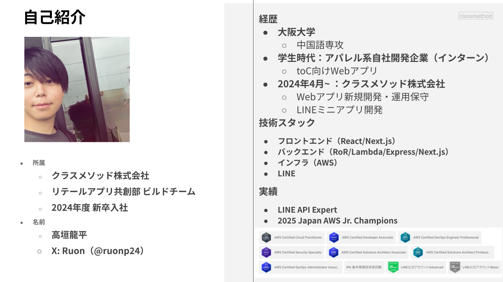

<!-- _class: title -->
<!-- _paginate: false -->

# **2026年度新卒研修 ブログ研修**

2026/04/01
クラスメソッド株式会社 リテールアプリ共創部
高垣 龍平

---

# 自己紹介

---

# 今日お話しすること

## 1. クラスメソッドの文化と「学習エンジン」
## 2. なぜブログを書くのか？
## 3. ブログの書き方
## 4. AI時代のブログ執筆
## 5. さっそく書いてみよう

---

<!-- _class: section -->
<!-- _paginate: false -->

## **クラスメソッドの文化と「学習エンジン」**

---

# クラスメソッドといえば？

 

## 「ブログの会社」

 

- IT業界で **「クラスメソッド = ブログ」** として広く認知されている
- 技術的な課題を検索すると、高確率で Developers.IO の記事がヒットする
- 社員一人ひとりが積極的にアウトプットする文化が **会社のブランド** になっている

 

### なぜそうなったのか？ → クラスメソッドの **文化** にその答えがある

---

<!-- _class: image -->

# 積極的な情報発信 - Developers.IO

---

# Developers.IO とは

### クラスメソッドが運営する技術ブログメディア

- 2011年7月にスタート
- 現在 **50,000本以上** の記事を掲載
- 社員が自ら手を動かして書く **「やってみた」** 記事が中心

 

### 特徴
- 憶測やセオリーだけでなく、**実地検証に基づく記事**を公開
- 事前レビューなし。エンジニアが書きたいときに書きたいことを書く
- ユーザに有益であれば社内のノウハウも余すところなく記事化

 

ブログは単なるタスクではなく、クラスメソッドの **カルチャーでありアイデンティティ**

---
<!-- _class: image -->

# 私のブログの例

---

<!-- _class: image -->

# 積極的な情報発信 - Zenn

---

<!-- _class: image -->

# Classmethod Leadership Principle（CLP）

---

# クラスメソッドの文化（CLP）

 

### やってみる - Start small -

> 検討に時間を掛け過ぎたり、できない理由を探したり、何もしないことは大きな機会損失です。過去の経験や知識のみを判断基準にせず、好奇心を持って、まずは小さく直ぐにやってみます。より早く始め、より多く失敗し、高速に改善を繰り返すことが私たちの最大の生存戦略です。

 

### 情報発信 - Output -

> 知識のアウトプットは最大のインプットに繋がり、その人の成長に繋がります。全ての人々の創造活動に貢献し続けるために、具体的かつ分かりやすい情報を社会に発信し続けます。自らの経験や知見が誰かの役に立つと信じ、次の世代に繋げる活動として続けます。

<!-- _class: image -->

---

# 情報発信のチャンスがゴロゴロある環境

---

# 「学習エンジン」とは？

 

### クラスメソッドで使われる言葉

経験の有無に関わらず、**圧倒的に成長が早い人** がいる

その人たちに共通するもの = **良い学習エンジン**を持っている

 

### 学習エンジンとは

**楽しみながら圧倒的なインプットとアウトプットを行い、知識や経験を蓄積させる仕組み**

- 人の中にある、何かを学ぶにおいてのエンジン
- エンジンの性能が高い人ほど、成長スピードが速い
- 技術の会社である以上、みんな何かしら技術に関わる仕事をする → **学習エンジンを回し続けてほしい**

---

<!-- _class: section -->
<!-- _paginate: false -->

## **なぜブログを書くのか？**

---

# エンジニアの成長サイクル

| ステップ | 内容 |
|---|---|
| **モチベーション** | 成長したい、技術を身につけたいという気持ち（知識欲・承認欲求・不安...） |
| **学習** | 本、記事、動画、セミナー、そして **手を動かす実践** |
| **アウトプット** | 学んだことを **他者に見える形** で出す |
| **評価** | 社内外から頼られ、仕事が任され、成果として認められる |

---

# なぜインプット/アウトプットを繰り返すのか？

### その方が **知識の定着効率がいい** から

### ラーニングピラミッド（平均学習定着率）

---

# クラスメソッドの活動をラーニングピラミッドに当てはめると

---

# ブログは「人に教える」行為

 

### 学んだことをブログに書く = 人に教える（定着率90%）

- ブログを書くためには、自分の理解を **整理・言語化** する必要がある
- 曖昧な理解のまま書こうとすると手が止まる → **理解の穴に気づける**
- つまり「最大のアウトプットは最大のインプット」

 

### さらに「自ら体験する」（定着率75%）と組み合わせると最強

- **手を動かして「やってみた」ことをブログに書く**
- 体験（75%）+ 人に教える（90%）= **学習効率が最大化**

 

### これがクラスメソッドの「やってみた」ブログの本質

---

# アウトプットがなぜ重要なのか？

 

### 学習は身につけただけでは評価されない

- 勉強して知識を身につけても、他者に見えなければ **「持っているかわからない」**
- 会社や上司も 「勉強しました」 と言われても評価のしようがない
- 承認欲求・自己顕示欲も満たされない

 

### その技術を身につけたことを **他者が認識して初めて評価される**

- 社内外で他者に **頼られる** ようになる
- 関連する仕事が **任せられる** ようになる
- 利益に貢献することで業務上の成果として **評価される**

---

# アウトプット先はブログだけじゃない

 

### 個人や組織の中での学習や経験をアウトプットする先

 

| アウトプット先 | 特徴 |
|---|---|
| **Developers.IO ブログ** | 社外に広く公開。最も影響力が大きい |
| **Zenn** | 技術記事プラットフォーム。個人の技術ブランディングに |
| **社内外の勉強会登壇** | プレゼン力も鍛えられる |
| **社内勉強会・Slack** | 気軽にナレッジ共有。フィードバックも得やすい |
| **Notion** | チーム内のドキュメント整備 |
| **業務改善・課題解決** | 自分や同僚、組織に対する直接的な貢献 |
| **実務そのもの** | 仕事の成果としてのアウトプット |

 

### その中でもブログは **最も手軽で、最も広く届く** アウトプット手段

---

# ブログがもたらす5つの効果

 

### 1. 知識の定着
書くために整理する過程で、曖昧だった理解が **明確になる**

### 2. 自分だけの資産になる
半年後の自分が 「あのときどうやったっけ？」 と振り返れる **備忘録**

### 3. 信頼の蓄積
継続的な発信が **「この人はこの分野に詳しい」** という信頼になる

### 4. 同じ課題を持つ人への貢献
自分がハマったポイントは **必ず他の誰かもハマる**

### 5. キャリアの武器になる
ブログは **ポートフォリオ** そのもの。スキルの証明になる

---

# ブログが「営業資料」になる

 

### アウトプットがインバウンドの営業活動になる

- 「ブログ見ました。クラスメソッドの○○さんにお願いしたい」
- 個人の発信が **会社全体の信頼・ブランド** につながっている
- エンジニアだけでなく、**営業メンバーもAIを活用してブログを書いている** 時代

 

### つまりブログは…

- **個人にとって** → スキルの証明、キャリアの武器
- **会社にとって** → 信頼の蓄積、営業資料、ブランディング
- **社会にとって** → 同じ課題を持つ人への貢献

 

### 書いたブログが勝手に営業してくれる。これが **アウトプットの複利効果**

---

# 2〜3年後、何で差がつくのか？

 

### 新卒はみんな「ヨーイドン」でスタートする

- でも2年後・3年後には **評価やキャリアに少しずつ差がつく**
- これは競争を煽りたいわけではなく、**どの会社でも起きる現実**

 

### 新卒は「何ができるか」が周りからわからない

- 中途なら履歴書や面接で **スキルや経験が伝わっている**
- 新卒は上司やチームメンバーから見て **「この子は何が得意？何がしたい？」** がわからない
- だからこそ **自分から「何ができるか」を示す** ことが重要

 

### その手段として **ブログが間接的に大きな差** を生む

---

# 実体験：ブログが回すキャリアの好循環

 

### 1年目からブログを書き続けた結果

1. 業務と並行して **LINE関連の技術情報をブログで発信**
2. 社内外から **「LINEがわかる人」** として認知される
3. **LINE関連の案件にアサイン** → 実務で成果を出す
4. **LINE APIエキスパート** に認定される
5. さらに学んだ技術をアウトプット → **好循環が回り続ける**

 

### 最近の例

- **AIの登壇依頼** が他部門から来る → ブログやSlackで発信しているから
- **部門を超えて** 自分の実績・できることが伝わり、仕事につながっている

 

### ブログは直接「給与が上がる」評価ではない。でも **間接的にいろいろ回ってくる**

---

# クラスメソッドの環境を最大限に活かそう

 

### 他の会社だと「自分はこれができます」と示すのは難しい

- 上司に直接アピールするのは意欲的だと思われるけど **やりにくい**
- そもそもブログの文化がない会社ではアウトプットの場がない

 

### クラスメソッドには環境がある

- みんなでブログを書く **文化とプラットフォーム** が整っている
- 新卒がアウトプットしても **まったく違和感がない**
- 「自分は何ができるのか」を自然に示せる環境が **すでにある**

 

### AWSでもAIでも何でもいい。**「私はこれが得意です」** を発信しよう

- この環境は当たり前じゃない。**使わないともったいない**
- 特に新卒は中途よりも意識して **自分が何を学んでいるか** をどんどんアウトプットしてほしい

---

<!-- _class: section -->
<!-- _paginate: false -->

## **ブログの書き方**

---

# 「やってみた」記事を書こう

 

### クラスメソッドの技術ブログの基本スタイル

 

- ドキュメントを読んだだけではなく、**自分で実際に触ってみた結果**を書く
- 「やってみた」形式は **新卒でも書きやすい** 最強のフォーマット

 

### 基本構成

1. **何をやったのか**（概要・背景）
2. **どうやったのか**（手順・コード）
3. **どうなったのか**（結果・スクリーンショット）
4. **何がわかったのか**（まとめ・所感）

---

# ブログを書くときのコツ

 

### 書くハードルを下げる
- 最初から完璧を目指さない。**質より量**
- 短い記事でもOK。「Hello World」でもいい
- レビューは不要。**最速のアウトプット** を意識する

 

### 読者を意識する
- 想定読者は **「1時間前の自分」**
- 専門用語は適度に説明する
- スクリーンショットを入れると圧倒的にわかりやすくなる

 

### 続けることが最も大切
- 最初はアクセスもシェアも伸びなくて当然
- **とにかく続ける。** 量がやがて質に転化する

---

# ブログのネタに困ったら

 

### 新卒にとってはすべてが「初めて」= すべてがネタ

- 開発環境のセットアップ手順
- 研修で学んだ技術の実践メモ
- エラーにハマって解決した記録
- 公式ドキュメントを読んで試してみた記録
- ツールやサービスを使ってみた感想

 

### 技術の話じゃなくてもいい

- 社会人としての **コミュニケーションスキル** や **営業スキル** を学ぶ機会もこれから多い
- そういった学びもブログのネタとして **まったく問題ない**
- エンジニアだけでなく、営業メンバーもブログを書いている

 

### 「こんなこと書いていいのかな？」→ **書いていい**

- 初心者目線の記事は **初心者にとって最も価値がある**
- 上級者が当たり前だと思っていることこそ、記事にする意味がある

---

<!-- _class: section -->
<!-- _paginate: false -->

## **AI時代のブログ執筆**

---

# AI時代だからこそブログの価値が上がる

 

### AIが普及した今、「情報を知っている」だけでは差別化できない

- AIは膨大な情報を瞬時に要約できる
- 単なる知識の羅列は AIに代替されうる

 

### では何が価値を持つのか？

- **実際にやってみた一次情報**（手を動かした経験）
- **ハマりポイントや試行錯誤のプロセス**（AIには書けないリアルな体験）
- **自分なりの解釈・意見・考察**（独自の視点）
- **最新の技術を即座に検証した速報性**（AIの学習データにはまだ含まれない）

 

### AI時代こそ **「自分で手を動かして、自分の言葉で書く」** ことの価値が増す

---

# AIをブログ執筆に活用する

 

### AIは「書く」を助けてくれる強力なツール

 

| 活用シーン | 具体例 |
|---|---|
| **構成の壁打ち** | 「こういう記事を書きたいんだけど、構成案を考えて」 |
| **下書きの補助** | 箇条書きのメモからたたき台を生成してもらう |
| **文章の推敲** | 書いた文章の読みやすさを改善してもらう |
| **技術的な確認** | 「この理解で合ってる？」と壁打ち相手にする |
| **タイトル案** | キャッチーなタイトルの候補を出してもらう |

 

### AIは **「書かない理由」を減らしてくれる** 最高のアシスタント

---

# AI活用の注意点

 

### AIに「書いてもらう」のではない

- AIが生成した文章を **そのままコピペして公開してはいけない**
- それは **あなたのアウトプットではない**
- 成長サイクルが回らなくなる

 

### 具体的に気をつけること

- **事実確認は必ず自分でやる** - AIはもっともらしい嘘をつく（ハルシネーション）
- **コード・コマンドは必ず自分で動かして検証する**
- **自分の言葉で書き直す** - AIの出力はあくまで叩き台
- **体験は自分でしかできない** - ハマったこと、感じたことはAIには書けない

 

### AIは道具。**主語は常に「自分」** であること

---

# AI時代のブログ執筆で意識すべきこと

 

### 1. 「自分でやってみた」を中心に据える
AIが書ける一般論ではなく、**自分の手で動かした結果**を書く

### 2. プロセスを大切にする
完成した結果だけでなく、**途中の試行錯誤や失敗も価値がある**

### 3. 自分の意見・解釈を入れる
「やってみてこう思った」「ここが意外だった」という **主観こそが差別化**

### 4. AIを使ったなら正直に書く
「AIを活用して効率化した部分」と「自分で検証した部分」を明確にする

### 5. 速度を武器にする
新しい技術が出たら **即やってみて即書く**。AIの学習データより早く動ける

---

# AIを使うのが「当たり前」の時代

 

### 上司もAIを使う前提で動いている

- タスクの締め切りや期限は **AIを使える前提** で設定されている
- AIを使わないと評価が下がるわけではないが、**成果を出すスピードが変わる**
- みんなAIを使う前提で動いているので、**皆さんにも慣れてほしい**

 

### ブログ研修の「裏テーマ」

- もちろんブログの良さ・マインドを持ってもらうことが目的
- でも同時に **「AIを使ってタスクを処理してみる」** という体験もしてほしい
- ブログ執筆を通じて **AIとの協働を実践する第一歩** にしてほしい

---

# 次のステップ：マークダウン × AIエージェント

 

### まずは今のツールでOK

- 手書きでもいいし、**ChatGPT** などを使って書いてもいい
- 最初の一歩はハードルを下げることが大切

 

### 将来的に目指してほしいこと

| ステップ | 内容 |
|---|---|
| **マークダウンで書く** | プレーンテキスト形式の記述。VS Code等で効率的に書ける |
| **VS Code を使う** | 拡張機能でプレビュー・補完・Git連携ができる高機能エディタ |
| **AIエージェントを使う** | Claude Code 等を使って、構成・下書き・推敲を効率化 |

 

### マークダウンで書く → VS Code で管理する → AIエージェントと協働する

- このスキルセットは **ブログだけでなく、あらゆる業務で活きてくる**
- エンジニアの方は早速チャレンジしてみてもいい

---

<!-- _class: section -->
<!-- _paginate: false -->

## **さっそく書いてみよう**

---

# 「ジョインブログ」を書こう

 

### ジョインブログとは？

- クラスメソッドに入社したメンバーが **最初に書くブログ**
- 社内外に向けた **自己紹介 × 決意表明**

 

### ジョインブログに書く内容

- **自分がどんな人物か**（出身・経歴・バックグラウンド）
- **これまでやってきたこと**（学生時代の経験、前職、スキルなど）
- **入社を決めた理由**（何に魅力を感じたか）
- **これからやっていきたいこと**（目標・興味のある技術領域）
- **趣味・好きなこと**（人となりが伝わると社内交流のきっかけに）

---

# ジョインブログの例

 

### 参考：私のジョインブログ

- [クラスメソッドにJOINしましたるおんです！](https://dev.classmethod.jp/articles/join_ruon/)

 

### ポイント

- **趣味や好きなこと** を書くと親しみやすく、社内交流のきっかけになる
- **大学でやってきたこと** を振り返って書いてみよう
- **クラスメソッド（オペレーションズ）を選んだ理由** は読む側も気になるポイント
- 写真やエピソードを添えると **「おっ」と目を引く** ジョインブログになる

 

### 書き方の詳細はこちら

- [ジョインブログを書く人が最初に読むエントリ](https://dev.classmethod.jp/articles/developers-io-tutorial-for-new-comers-2020/)

---

# ジョインブログの後は？

 

### 1. 「やってみた」記事に挑戦しよう

- テーマは何でもOK
- 研修で触った技術、セットアップ手順、何でもネタになる
- **完璧じゃなくていい。まず出すことが大事**

 

### 2. Developers.IO のブログ記事を読んでみよう

- 先輩社員がどんな記事を書いているか観察する
- 「やってみた」記事のフォーマットを参考にする

 

### 3. 継続する仕組みを作ろう

- ネタ帳をつける（メモアプリ、Notion、なんでもOK）
- 「あ、これブログになるな」というアンテナを張る

---

# Developers.IO のセットアップ

 

### 1. 招待メールを確認

- 件名：**「Classmethodブログ DevelopersIOのログインについて」**
- メールに記載された手順に従ってアカウントを有効化する

 

### 2. Contentful にログイン

- ログインURL：**https://be.contentful.com/login**
- 招待メールに記載された情報でログイン

 

### 3. セットアップの詳細手順

- [DevelopersIO セットアップガイド（社内ドキュメント）](https://docs.google.com/document/d/1XU3kWpWxbDT0yB6hCQLYX1D1_Pmz1aA75HeaYbs0Zl8/edit?tab=t.0#heading=h.lim6x36os00y)

---

# まとめ

 

### 学習エンジンを回そう

- **モチベーション → 学習 → アウトプット → 評価** のサイクルを回す
- ブログは **「人に教える」行為** = 学習定着率90%の最強の学習法

 

### CLP「やってみる」「情報発信」を体現しよう

- 質より量。レビュー不要。**まずは小さく直ぐにやってみる**
- アウトプットの重要性を全員が意識することが一番重要
- その結果が **カルチャー** になり、**アイデンティティ** になる

 

### AI時代だからこそ

- **自分で手を動かした一次情報** の価値が上がる
- AIは最高のアシスタント。でも **主語は常に自分**
